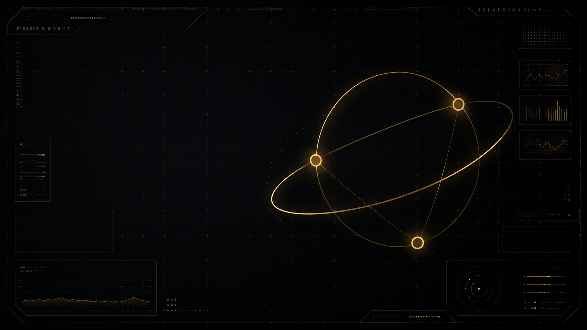

<p align="center">
  
</p>

<h1 align="center">Juno Oversight</h1>

<p align="center">
  <strong>长时任务 Agent 编排器</strong> — 机构终端 HUD + 可审计的 implement → review → verify 流水线<br/>
  人定章程 · Juno 自主跑 slot · 人验收 Promote
</p>

<p align="center">
  <a href="https://github.com/FranklinNexus/Juno-Oversight"></a>
  &nbsp;
  
  
  
  
</p>

<p align="center">
  <a href="#快速开始">快速开始</a> ·
  <a href="#核心能力">能力</a> ·
  <a href="#文档">文档</a> ·
  <a href="./wiki/whitepaper.md">白皮书</a> ·
  <a href="./wiki/juno-architecture.md">架构</a>
</p>

---

## 一句话

**Juno** 把 Cursor Agent 从「聊完就散」变成 **可续跑、可审查、可限流** 的长任务系统：每个 slot 有 scope、checkpoint 和出队门禁；你在 HUD 里看队列与 Run，在 Promote 面板里决定是否进 Vault。

适合：overnight 写书、大规模文献 synthesis、Orchestrator 自迭代、以及任何需要 **Review 签字才能前进** 的 builder 工作流。

---

## 为什么不是「多开几个 Cursor 窗口」

| 痛点 | Juno 的做法 |
|------|-------------|
| 对话上下文会丢 | **checkpoint.md** 跨 slot 唯一记忆 |
| Agent 改飞范围 | 每 Mission **scope-lock** 限定路径 |
| 改完就算完 | **REVIEW_VERDICT** / **VERIFY_REPORT** 机器可读门禁 |
| 7×24 不可控 | **日迭代上限** + API Gateway backoff |
| Vault 被误写 | **Hook 防火墙** — Agent 只读 Obsidian |
| 不知道系统在干嘛 | **HUD**：Queue · Active Run · Mission Board · Promote |

---

## 怎么工作

```text
  ┌─────────────┐     ┌──────────────────┐     ┌─────────────┐
  │  你：章程    │ ──▶ │  Juno：选 Mission │ ──▶ │ Cursor Agent │
  │  charter    │     │  排队 · spawn     │     │  implement   │
  └─────────────┘     └──────────────────┘     └──────┬──────┘
         ▲                        ▲                    │
         │                        │                    ▼
  ┌──────┴──────┐     ┌───────────┴────────┐   review → verify
  │ Promote 进   │     │ Workbench 状态      │        │
  │ Vault（人）  │     │ queue · runs · log  │◀───────┘
  └─────────────┘     └────────────────────┘
```

1. **你** 写 North Star / scope-lock，或只改 `autonomy-charter.json` 定方向  
2. **Planner** 从 registry 选下一 Mission，写入 `queue/now.yaml`  
3. **Spawn** 拉起 Live Composer slot；Agent 只改允许路径并更新 checkpoint  
4. **门禁** 通过才出队；BLOCK 则队列停住等你  
5. **Promote**（可选）把 staging 内容预览 diff 后复制进 Vault  

<p align="center">
  
</p>

> 模块级细节 → [wiki/juno-architecture.md](./wiki/juno-architecture.md)

---

## 核心能力

### 编排内核（Overseer）

- 统一 **implement → review → verify** 流水线，本地 runner 与 Live API 共用门禁  
- **Model fallback**：`auto` → `composer-2.5` → `composer-2`  
- **Hardening 已闭合**（h01–h11）：promote 预览、verify:desktop、漂移审计  

### 有限自主（Bounded Autonomy）

- `pnpm juno:daemon` — 后台按章程推进，**默认 12 次/日**，cap 满睡到 0:00  
- **Mission Planner** — 队列头优先，不必人工逐条 assign  
- **Evolution fitness** — 7 日滑动；连续下降触发 self-optimize  

### 安全默认

- Vault **只读** · 禁止 `git reset --hard` / 递归删盘  
- Promote **默认需人确认**  
- Workbench purge **仅** `runs/`、`staging/`，且要 `--i-understand`  

### 战术 HUD（桌面 / 浏览器）

Next.js + Tauri：**Run Queue · Active Run · Scheduler · Mission Board · Promote 预览** — 与行情 / GitHub / Jupiter 等 Widget 同屏。

<p align="center">
  
</p>

---

## 快速开始

### 环境

| 工具 | 版本 |
|------|------|
| Node.js | ≥ 22.13 |
| pnpm | 10+ |
| Rust | 1.77+（仅桌面打包） |

### 1. 安装

```bash
git clone https://github.com/FranklinNexus/Juno-Oversight.git
cd Juno-Oversight
pnpm install
pnpm test          # 126 tests
pnpm dev           # http://localhost:3000
```

### 2. 配置

```bash
cp .env.example .env.local
```

| 变量 | 说明 |
|------|------|
| `AGENT_WORKBENCH_ROOT` | 运行时目录，如 `E:\AgentWorkbench` |
| `JUNO_OVERSIGHT_ROOT` | 本仓库绝对路径 |
| `CURSOR_API_KEY` | Live Composer（`mission:loop` / daemon） |

### 3. 初始化 Workbench（一次）

```powershell
.\scripts\scaffold-workbench.ps1
node scripts/sync-workbench-hooks.mjs
```

从 `config/*.example.json` 复制到 Workbench `config/` — 清单见 [config/README.md](./config/README.md)。

### 4. 验证与桌面 HUD

```bash
pnpm orchestrator:build
pnpm verify:desktop
pnpm tauri:dev
```

### 5. 让 Juno 自己跑

```bash
pnpm autonomy:tick              # 预览 planner 下一动作
pnpm juno:daemon                # 推荐：后台 bounded autonomy
pnpm evolution:tick             # 写 fitness（不耗 API）
```

---

## 常用命令

| 场景 | 命令 |
|------|------|
| 最小闭环试跑 | `pnpm loop:smoke` |
| 跑队列头 Live slot | `pnpm mission:loop` |
| 书稿质量修复 | `pnpm book:quality-loop` |
| 自优化一轮 | `pnpm self:optimize` |
| 每日 cap + 隔离导出 | `pnpm daily:juno` |
| Workbench 安全清理 | `pnpm workbench:purge` |
| 全量桌面门禁 | `pnpm verify:desktop` |

<details>
<summary>更多命令（AGI · 公理之书 · 自迭代）</summary>

```bash
pnpm queue:agi-literature && pnpm agi:loop
pnpm queue:axiom-book && pnpm book:loop
pnpm loop:self-iterate-p2-run
pnpm queue:von-neumann && pnpm queue:hardening
```

演进路线图 → [wiki/architecture-loop.md](./wiki/architecture-loop.md)

</details>

---

## 仓库结构

```text
Juno-Oversight/          ← 本仓库（git）
├── src/                 HUD（Next.js）
├── src-tauri/           桌面壳（Tauri）
├── orchestrator/src/    编排内核
├── scripts/             daemon · loop · bootstrap
├── wiki/                产品与架构文档
└── config/              Workbench 配置示例

AgentWorkbench/          ← 运行时（不进 git）
├── queue/now.yaml       当前 slot 队列
├── runs/<id>/           checkpoint · events.jsonl
├── missions/<id>/       north-star · scope-lock · progress
└── state/               autonomy · planner · evolution
```

---

## 文档

|  |  |
|--|--|
| [系统架构](./wiki/juno-architecture.md) | 模块地图、状态文件、Planner、Von Neumann |
| [Wiki 索引](./wiki/README.md) | 全文档目录 |
| [质量门禁](./wiki/overseer-quality.md) | REVIEW_VERDICT 规范 |
| [Bounded Autonomy](./wiki/juno-bounded-autonomy.md) | 日限额与 daemon |
| [维护手册](./wiki/maintenance.md) | 排错与打包 |

---

## 安全边界

| 规则 | 实现 |
|------|------|
| 禁止读写 Obsidian Vault | `.cursor/hooks/vault-gate` |
| 禁止 destructive git / shell | `destructive-ops-gate` |
| 自主迭代日上限 | `bounded-autonomy.json`（默认 12/日） |
| Live API 限流 | `api-gateway` + backoff |

---

## 桌面发布

```bash
pnpm build && pnpm tauri build
```

静态 export 不含动态 `/api/market`；LIVE 行情见 [maintenance.md](./wiki/maintenance.md)。

---

## 许可

MIT 风格开源 — [FranklinNexus/Juno-Oversight](https://github.com/FranklinNexus/Juno-Oversight)。  
行为以 `orchestrator/src/` 与 Wiki 为准；冲突时以代码 + [juno-architecture.md](./wiki/juno-architecture.md) 为真源。

<p align="center">
  
  <br/>
  <sub>Observe · Plan · Act · Measure · Mutate</sub>
</p>
