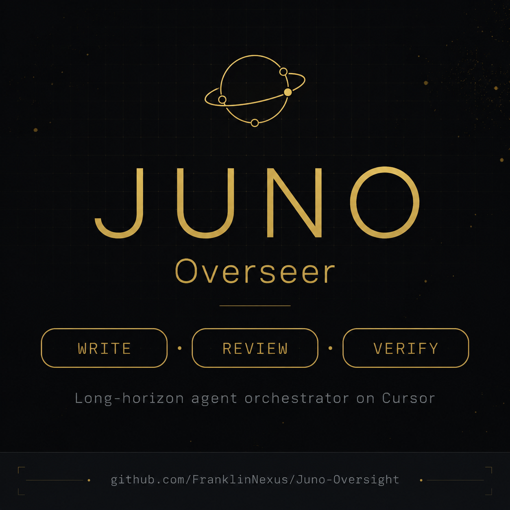
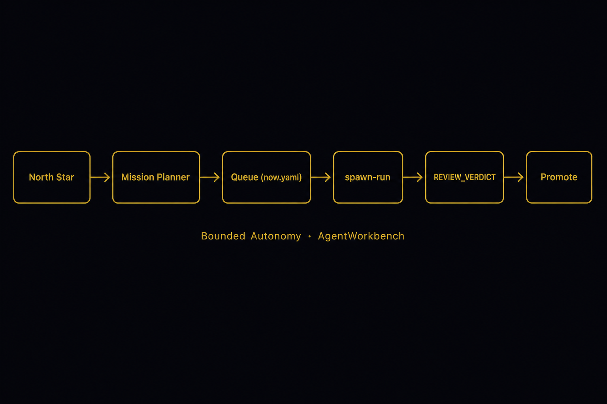
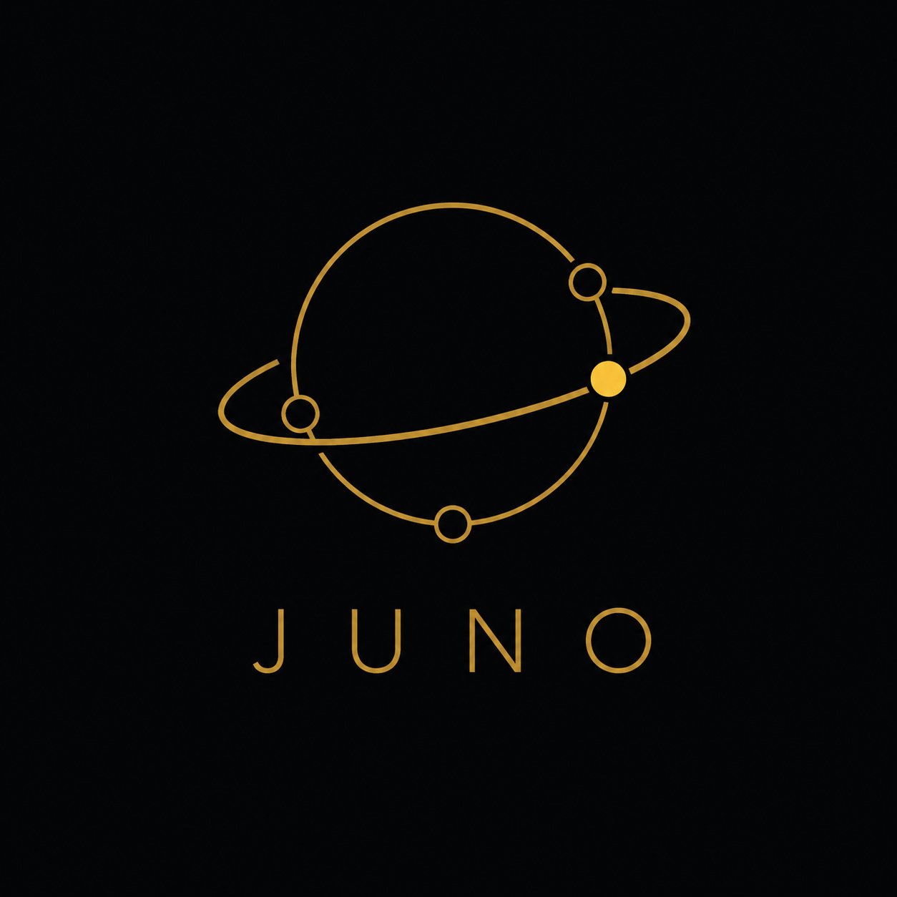

<p align="center">
  
</p>

<h1 align="center">Juno</h1>

<p align="center">
  <strong>The Runtime for AI Work.</strong>
</p>

<p align="center">
  <strong>LLMs write. Juno governs.</strong><br/>
  <em>Models generate. Gates decide.</em>
</p>

<p align="center">
  Long-running AI work with deterministic checkpoints, review gates, and bounded autonomy.
</p>

<p align="center">
  
  
  
</p>

---

```text
Agent finished
      │
      ▼
   Review  ──►  PASS · REVISE · BLOCK
      │
      ▼
   Verify  ──►  tests · lint · build
      │
      ▼
  Promote  ──►  human confirm
      │
      ▼
    Vault
```

**This is not another chat loop. This is a Pull Request for AI work.**

```bash
git clone https://github.com/FranklinNexus/Juno-Oversight.git && cd Juno-Oversight
pnpm install && pnpm loop:smoke
```

No API key. Two minutes. `implement → review → verify`.

<p align="center">
  
</p>

> **GitHub manages source code. Juno manages AI work.**

```text
Git  →  GitHub  →  Juno
code     collaboration   AI work
```

Not competitors. **Git** versions files. **GitHub** versions collaboration. **Juno** versions *AI work* — checkpoints, gates, replay, promote.

---

## Why

**Without Juno**

```text
Agent finished.

Trust me.
```

**With Juno**

```text
Agent finished.

PASS · BLOCK · REVISE

Machine-readable.
Replayable.
Auditable.
```

| Without Juno | With Juno |
|--------------|-----------|
| Context dies between sessions | **Checkpoint** is durable memory |
| Model says “done” | **Oversight** decides dequeue |
| Agents edit anything | **Scope lock** per mission |
| 24/7 = unbounded risk | **Bounded autonomy** — cap, backoff, escalate |
| Vault accidents | **Hooks** block writes & destructive ops |

Juno is not an agent framework. It is an **AI Work Runtime** — queue, spawn, gate, replay, promote.

---

## Oversight

Every engineering team uses **Pull Requests**. Long-running AI work needs the same — but machine-readable.

After each run, the **Oversight layer** emits a verdict:

```markdown
## REVIEW_VERDICT
- verdict: PASS | REVISE | BLOCK
- drift: none | minor | major
- scope_violations: []
- must_fix_next_slot: []
```

| Verdict | What happens |
|---------|----------------|
| **PASS** | Queue advances |
| **REVISE** | Fix run queued with `must_fix` |
| **BLOCK** | **Stops.** No silent drift. Human decides. |

**Implement** requires `STATUS: COMPLETE` + `## CHANGES`. **Verify** requires `## VERIFY_REPORT`. Empty checkpoint → **hold**.

> **Models are probabilistic. Oversight isn't.**

Most stacks (AutoGen, CrewAI, OpenHands, LangGraph, …) end at *task complete*. Juno adds **audit · replay · resume · promote** — closer to **CI for AI work** than to another chat loop.

Full spec → [wiki/overseer-quality.md](./wiki/overseer-quality.md)

---

## Showcase

| Workload | Status |
|----------|--------|
| Overnight book (公理之书) | ✅ |
| Repo hardening (h01–h11) | ✅ |
| Literature synthesis (1000 papers) | ✅ |
| Workbench cleanup | ✅ |
| Self-iteration (P0–P2 loops) | 🟡 |
| Von Neumann evolution (fitness v1) | 🟡 |
| Multi-agent debate slot | 🚧 |
| Weighted Governance Score | 🚧 |

One **`pnpm juno:daemon`**: charter in, gated work out — no hand-assigning every mission.

---

## Architecture

**Conceptual**

```text
Policy  →  Planning  →  Execution  →  Oversight  →  Approval
```

**Implementation**

```text
charter  →  planner  →  implement  →  review  →  verify  →  promote  →  Vault
              │              │            │
         (hooks)        (spawn)     (REVIEW_VERDICT)
```

| Layer | Role |
|-------|------|
| **Runtime** | Queue · spawn · gates · daemon (`orchestrator/` + `scripts/`) |
| **Surface** | HUD — queue, active run, promote preview (`src/` + Tauri) |
| **State** | Local work dir — missions, checkpoints, audit log (`AgentWorkbench/`, not in git) |

Environment: `AGENT_WORKBENCH_ROOT` · `JUNO_OVERSIGHT_ROOT` · `CURSOR_API_KEY` (Live runs).

---

## Quick start

```bash
git clone https://github.com/FranklinNexus/Juno-Oversight.git
cd Juno-Oversight
pnpm install
pnpm loop:smoke          # no API · end-to-end pass
```

<details>
<summary><strong>Advanced — daemon, HUD, Live runs</strong></summary>

```bash
cp .env.example .env.local
.\scripts\scaffold-workbench.ps1          # Windows; see wiki/runtime.md
node scripts/sync-workbench-hooks.mjs
pnpm orchestrator:build && pnpm verify:desktop
pnpm tauri:dev                            # Surface
pnpm juno:daemon                          # Runtime loop
pnpm autonomy:tick                        # Preview next mission (dry-run)
```

| You want… | Command |
|-----------|---------|
| Run queue head (Live) | `pnpm mission:loop` |
| Safe cleanup | `pnpm workbench:purge` |
| Full desktop gate | `pnpm verify:desktop` |
| Evolution fitness tick | `pnpm evolution:tick` |

Config → [config/README.md](./config/README.md) · Troubleshooting → [wiki/maintenance.md](./wiki/maintenance.md)

</details>

---

## Eight words

Everything else is implementation detail.

| Term | Meaning |
|------|---------|
| **Mission** | A bounded goal (north-star + scope-lock + phases) |
| **Queue** | Ordered work in `now.yaml` |
| **Run** | One Live or local agent execution |
| **Checkpoint** | Durable memory for a run / mission |
| **Gate** | Deterministic pass/fail (review · verify · complete) |
| **Charter** | Your rules — what Juno may do autonomously |
| **Promote** | Human-approved copy into Vault |
| **Runtime** | Juno itself — not the LLM |
| **Oversight** | The layer that decides PASS / BLOCK / REVISE |

---

## Theory & philosophy

<details>
<summary><strong>For readers who want the “why it’s built this way” story</strong></summary>

### Deterministic oversight

Intelligence is probabilistic. **Oversight is deterministic.** Juno separates *generation* (Cursor / MCP) from *permission to proceed* (TypeScript gates, hooks, caps).

### Bounded autonomy (not “AGI”)

Juno does **not** promise open-ended self-evolution. It ships **bounded autonomy**: daily iteration cap, mission whitelist, API backoff, `escalate_human` when fitness drops under load. That is engineering, not a manifesto.

### Von Neumann unit (v0–v1)

Open-system framing: charter + registry = genotype (human-owned); spawn + loops = constructor; git + export + evolution-log = replicator; planner + daemon = controller.

```
observe → plan → act → measure → mutate (∩ whitelist)
```

Current fitness (project KPIs today):

```
fitness = -10×failedChapters + 5×hardeningDone + 2×capRatio + apiHealth(-20) - 3×idle
```

**Direction:** evolve toward a **Weighted Governance Score** — Reliability · Recoverability · Auditability · Human Load · Latency · Token Efficiency — so the same runtime serves coding, research, trading, analysis without rewrites.

### Negative entropy · scalable oversight

Workbench holds ephemeral runs/staging; Vault stays read-only. Agent proposes next mission; human keeps **charter** and **promote**. Amodei-style oversight without unbounded AutoGPT loops.

### The category

Docker invented **containers**. GitHub invented the **Pull Request**. Terraform invented **IaC**. Kubernetes invented **desired state**.

**Juno invents the AI Work Runtime** — the layer where long-running agent work gets checkpoints, gates, and replay. We want teams to say:

> *"We run our agents on Juno Runtime."*

> *"This project needs an AI Work Runtime."*

Deep dives → [evolution.md](./wiki/evolution.md) · [overseer-quality.md](./wiki/overseer-quality.md)

</details>

---

## Docs

| When you need… | Link |
|----------------|------|
| Wiki index | [wiki/README.md](./wiki/README.md) |
| Module map & state | [wiki/runtime.md](./wiki/runtime.md) · [juno-architecture.md](./wiki/juno-architecture.md) |
| Oversight spec (authoritative) | [overseer-quality.md](./wiki/overseer-quality.md) |

---

## License

MIT-style — [FranklinNexus/Juno-Oversight](https://github.com/FranklinNexus/Juno-Oversight). Source of truth: `orchestrator/src/` + wiki when aligned.

<p align="center">
  
  <br/>
  <sub><strong>Juno</strong> — The Runtime for AI Work · LLMs write. Juno governs.</sub>
</p>
