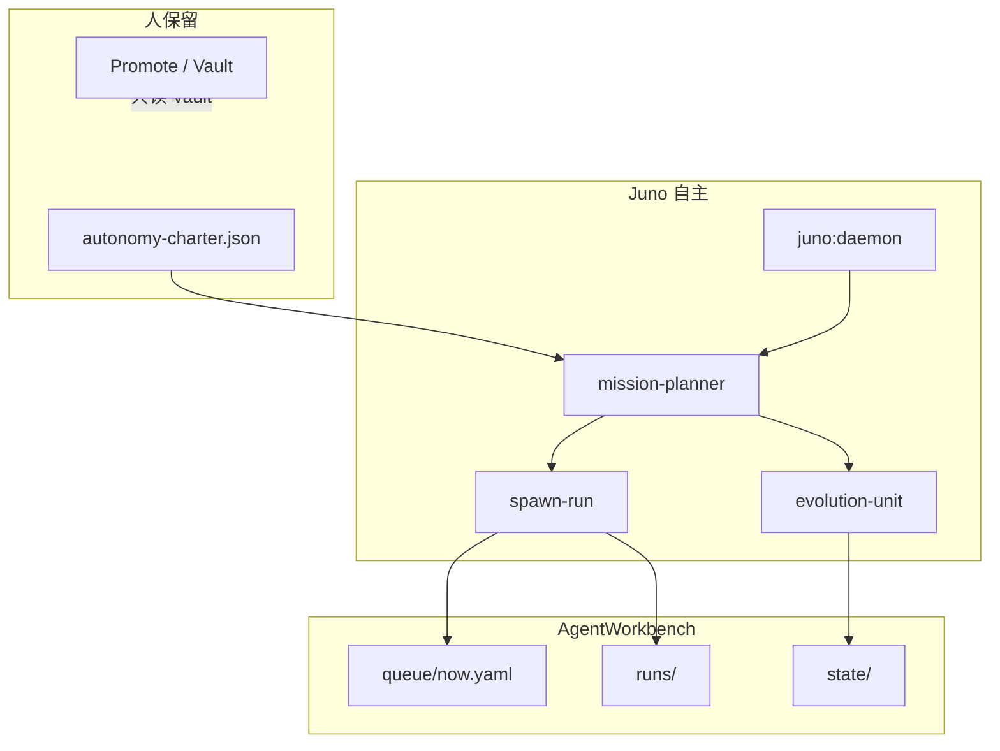

<p align="center">
  
</p>

<p align="center">
  <strong>Juno Oversight</strong> — 机构终端风格 HUD + 长任务 Agent 编排层<br/>
  <em>人定 North Star · Juno 跑 slot · 人验收 Promote</em>
</p>

<p align="center">
  <a href="https://github.com/FranklinNexus/Juno-Oversight">GitHub</a> ·
  <a href="./wiki/README.md">Wiki</a> ·
  <a href="./wiki/juno-architecture.md">系统架构</a> ·
  <a href="./wiki/whitepaper.md">白皮书</a>
</p>

<p align="center">
  
  
  
  
</p>

---

## 这是什么

**Juno Oversight** 把 Cursor Agent 从「单次对话」升级为 **可审计的长时任务系统**：

| 层 | 职责 |
|----|------|
| **HUD** | 战术看板 — Run Queue、Active Run、Scheduler、Mission Board、Promote |
| **Overseer** | 编排内核 — `implement → review → verify`，checkpoint 跨 slot 记忆 |
| **AgentWorkbench** | 运行时状态 — queue、missions、runs（不进 git） |
| **Von Neumann v1** | fitness 度量 + planner 反馈 — 自指进化闭环 |

同一套门禁可跑：smoke → P0–P2 自迭代 → **1000 篇 AGI 文献** → **overnight 写书** → quality REVISE → **Overseer 硬化（已 COMPLETE）** → 自主 cleanup / 下一 mission。

<p align="center">
  
</p>

> **架构细节** → [wiki/juno-architecture.md](./wiki/juno-architecture.md)（模块地图、状态文件、planner 优先级、Von Neumann 闭环）

---

## 架构一图（2026-07）



---

## 核心能力

<table>
<tr>
<td width="50%" valign="top">

### 编排与门禁

- **REVIEW_VERDICT** 机器可读 — BLOCK 不出队
- **VERIFY_REPORT** 必填 — 空 checkpoint 不出队
- **scope-lock** 每 Mission 限定可改路径
- **Quality Gate** — spaced-bold、字数（程序化 + LLM）
- **API Gateway** — RPM / 并发 / 日 token / backoff
- **Model fallback** — `auto` → `composer-2.5` → `composer-2`

</td>
<td width="50%" valign="top">

### 自主与进化

- **Mission Planner** — 章程驱动，自选下一任务
- **`pnpm juno:daemon`** — 后台 bounded autonomy（cap 满睡到 0:00）
- **Evolution fitness** — 7d MA；连续下降 → self-optimize
- **Hardening queue repair** — progress.md 同步 now.yaml
- **Vault / destructive 防火墙** — `.cursor/hooks`
- **Daily export** — 隔离目录，不碰 Vault

</td>
</tr>
</table>

---

## 快速开始

### 1 · 克隆与安装

```bash
git clone https://github.com/FranklinNexus/Juno-Oversight.git
cd Juno-Oversight
pnpm install
pnpm dev          # http://localhost:3000
pnpm test         # 126 tests
```

| 工具 | 版本 |
|------|------|
| Node.js | **≥ 22.13** |
| pnpm | 10+ |
| Rust | 1.77+（仅 `tauri:dev` / 桌面打包） |

### 2 · 环境变量

```bash
cp .env.example .env.local
```

| 变量 | 必需 | 说明 |
|------|:----:|------|
| `AGENT_WORKBENCH_ROOT` | ✓ | 运行时目录，如 `E:\AgentWorkbench` |
| `JUNO_OVERSIGHT_ROOT` | ✓ | 本仓库绝对路径 |
| `CURSOR_API_KEY` | Live | Cursor Composer spawn |
| `OPENAI_API_KEY` | — | `provider: api_token` fallback |

### 3 · 初始化 Workbench（一次）

```powershell
.\scripts\scaffold-workbench.ps1
node scripts/sync-workbench-hooks.mjs

$config = "E:\AgentWorkbench\config"
Copy-Item config\api-limits.example.json           $config\api-limits.json
Copy-Item config\self-optimize.example.json       $config\self-optimize.json
Copy-Item config\mcp-servers.example.json         $config\mcp-servers.json
Copy-Item config\autonomy-charter.example.json   $config\autonomy-charter.json
Copy-Item config\evolution-unit.example.json     $config\evolution-unit.json
Copy-Item config\model-defaults.example.json     $config\model-defaults.json
Copy-Item config\daily-schedule.example.json      $config\daily-schedule.json
```

详见 [config/README.md](./config/README.md)。

### 4 · Orchestrator + 桌面 HUD

```bash
pnpm orchestrator:build
pnpm verify:desktop    # test + lint + build + orchestrator + cargo
pnpm tauri:dev         # HUD + Workbench 快照
```

---

## 让 Juno 自己动起来

```bash
pnpm autonomy:tick              # 预览 mission-planner 决策
pnpm autonomy:tick --execute    # 执行一轮
pnpm juno:daemon                # 后台循环（推荐）
pnpm evolution:tick             # 写 fitness + evolution-log（无 API）
```

### 每日自动（刷满 cap + 隔离导出 + purge）

```bash
pnpm daily:juno                 # 立即跑（仅 cap 停，默认不因 idle 提前退出）
pnpm daily:juno:install         # Windows 计划任务 0:00
```

导出到 **隔离目录**（默认 `E:\JunoDailyExport`）。详见 [juno-daily-schedule.md](./wiki/juno-daily-schedule.md)。

**Planner 优先级**（摘要）：cap → fitness/backoff → quality → self-optimize → 队列头 → registry。

---

## 命令速查

<details>
<summary><strong>开发与验证</strong></summary>

```bash
pnpm dev | build | test | lint
pnpm verify:desktop
pnpm loop:smoke
pnpm orchestrator:build
pnpm orchestrator:test:live
pnpm api:quota
```

</details>

<details>
<summary><strong>自主 · 进化 · Mission</strong></summary>

```bash
pnpm juno:daemon
pnpm autonomy:tick --execute
pnpm mission:loop              # generic Live slot
pnpm evolution:tick
pnpm queue:von-neumann
pnpm self:optimize
pnpm queue:hardening           # 按 progress 修复 h07–h11 队列
pnpm queue:cleanup
pnpm workbench:purge
```

</details>

<details>
<summary><strong>AGI · 公理之书 · 自迭代</strong></summary>

```bash
pnpm queue:agi-literature && pnpm agi:loop
pnpm queue:axiom-book && pnpm book:loop
pnpm book:quality-loop && pnpm book:quality-fix
pnpm loop:self-iterate-p2-run
```

</details>

---

## 推荐路径

```text
loop:smoke → loop:self-iterate-p2-run
  → queue:agi-literature → agi:loop
  → queue:axiom-book → book:daemon
  → queue:von-neumann → juno:daemon
  → self:optimize → mission:loop（cleanup / 下一 mission）
```

完整演进见 [architecture-loop.md](./wiki/architecture-loop.md)。

---

## 目录结构

```text
src/                      Next.js HUD + Overseer Widgets
src-tauri/                Tauri IPC（Promote、orchestrator 控制）
orchestrator/src/         编排内核（见 wiki/juno-architecture.md §5）
scripts/                  loop runners · daemon · bootstrap
wiki/                     产品与架构文档
config/                   Workbench 配置示例
missions-templates/       Mission 脚手架
docs/assets/              README 插图
.cursor/hooks/            Vault + destructive-ops 防火墙
```

**运行时**（`AgentWorkbench/`，不进 git）：

```text
queue/now.yaml     当前 slot 队列
runs/<id>/         checkpoint · events.jsonl · manifest
missions/<id>/     progress · scope-lock · north-star
state/             autonomy · planner · evolution · api-quota
config/            charter · api-limits · evolution-unit
```

---

## 文档索引

| 文档 | 说明 |
|------|------|
| [**系统架构**](./wiki/juno-architecture.md) | **模块地图、状态文件、planner、Von Neumann** |
| [Wiki 索引](./wiki/README.md) | 全文档地图 |
| [Von Neumann 单元](./wiki/juno-von-neumann-unit.md) | fitness · 突变白名单 |
| [Bounded Autonomy](./wiki/juno-bounded-autonomy.md) | 日限额 · daemon |
| [Overseer 质量门禁](./wiki/overseer-quality.md) | REVIEW_VERDICT 权威 |
| [Orchestrator](./wiki/orchestrator.md) | spawn · scheduler |
| [Workbench](./wiki/workbench.md) | 运行时目录 |
| [维护手册](./wiki/maintenance.md) | 排错 · 打包 |

---

## 安全边界

| 规则 | 机制 |
|------|------|
| 禁止读写 Obsidian Vault | `vault-gate` hook |
| 禁止 destructive git / shell | `destructive-ops-gate` + `safety-doctrine` |
| Promote 进 Vault | 默认 `require_human: true` |
| 自主迭代日上限 | `state/bounded-autonomy.json`（默认 12/日） |
| orchestrator 无 `file:..` 父依赖 | `check-orchestrator-deps.mjs` |
| Live API burst | `api-gateway` + backoff |

---

## 桌面发布

```bash
pnpm build              # 静态 export → out/
pnpm tauri build
```

静态包不含动态 `/api/market`；LIVE 行情需 MOCK 或外置代理（见 [maintenance.md](./wiki/maintenance.md)）。

---

## 许可

MIT 风格开源协作 — [FranklinNexus/Juno-Oversight](https://github.com/FranklinNexus/Juno-Oversight)。  
行为以 `orchestrator/src/` 与 Wiki 为准；冲突时 **代码 + [juno-architecture.md](./wiki/juno-architecture.md)** 优先。

<p align="center">
  
  <br/>
  <sub>Juno Overseer · Observe · Plan · Act · Measure · Mutate</sub>
</p>
