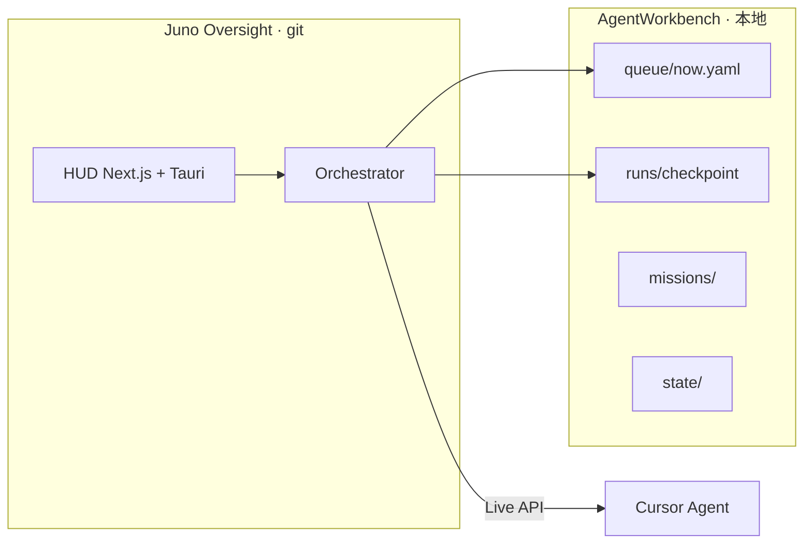

<p align="center">
  
</p>

<h1 align="center">Juno Oversight</h1>

<p align="center">
  <strong>长时任务 Agent 编排器</strong> — 机构终端 HUD + 可审计的 implement → review → verify 流水线<br/>
  人定章程 · Juno 自主跑 slot · 人验收 Promote
</p>

<p align="center">
  <a href="https://github.com/FranklinNexus/Juno-Oversight"></a>
  &nbsp;
  
  
  
  
</p>

<p align="center">
  <a href="#设计起点">设计起点</a> ·
  <a href="#架构">架构</a> ·
  <a href="#质量门禁">门禁</a> ·
  <a href="#快速开始">快速开始</a> ·
  <a href="#进一步阅读">Wiki</a>
</p>

---

## 一句话

**Juno** 把 Cursor Agent 从「聊完就散」变成 **可续跑、可审查、可限流** 的长任务系统：每个 slot 有 scope、checkpoint 和出队门禁；你在 HUD 里看队列与 Run，在 Promote 面板里决定是否进 Vault。

---

## 设计起点

### 要解决什么问题

长任务（overnight 写书、千篇文献 synthesis、编排器自迭代）在「单次 Chat」里做不成，不是因为模型不够聪明，而是因为缺少三样东西：

1. **跨 session 的外显记忆** — 不能靠对话历史  
2. **可机器执行的验收** — 不能靠「感觉改好了」  
3. **有上限的自主** — 不能 7×24 无界 spawn  

Juno 的立场：**不先追求「全自动 AGI」**，而是先造一个 **可证伪、可审计、可睡 overnight 的工程闭环**。在这个闭环上，再叠进化与自优化。

### 理论锚点（为何现在可实现）

| 来源 | 在 Juno 里的工程翻译 |
|------|----------------------|
| **冯·诺依曼自复制** | 描述带（charter + registry + rubric）+ 构造器（spawn / implement）+ 复制器（git · daily export · evolution-log） |
| **薛定谔负熵** | 开放系统：API / MCP / 磁盘是「原始汤」；Juno 用 quality-scan、purge、hardening 把 **熵增关进 Workbench**，Vault 与宪法层不进 soup |
| **Amodei 式 scalable oversight** | Agent 提议下一 Mission；**人只保留章程与 Promote**；BLOCK 不出队 |
| **Cursor Composer 作为效应器** | Live slot 足够完成 implement/review；门禁与 checkpoint 由 **确定性代码** 判定，不交给模型「自觉」 |

最小自指单元（v0）一句话：

> `observe → plan → act → measure(fitness) → mutate(∩whitelist)` 在 charter 内闭环，且每步可审计。

这不是封闭系统里的「纯自举」——外界提供 API、MCP、计划任务；**不提供逐步 mission assign**。人改的是 **方向（章程）**，不是 **每一步按钮**。

### 产品分层：宪法 / 体细胞 / 效应器

```text
  ┌─ 宪法（人 promote，Agent 不可写）────────────────────┐
  │  autonomy-charter · Vault hooks · destructive-ops gate │
  └──────────────────────────┬─────────────────────────────┘
                             ▼
  ┌─ 体细胞（白名单内可进化）──────────────────────────────┐
  │  mission-registry · quality-rubric · workflow · scripts │
  └──────────────────────────┬─────────────────────────────┘
                             ▼
  ┌─ 效应器（与外界交互）──────────────────────────────────┐
  │  Cursor API · MCP · Workbench runs/staging · 计划任务   │
  └────────────────────────────────────────────────────────┘
```

**可实现性边界（诚实声明）**：v0–v1 已落地的是 **控制器 + 度量器 + 门禁**；完整「orchestrator 自改且自证」在路线图 v3。当前价值是 **长任务不丢、不漂、可限流地跑通**。

---

## 为什么不是「多开几个 Cursor 窗口」

| 痛点 | Juno 的做法 |
|------|-------------|
| 对话上下文会丢 | **checkpoint.md** 跨 slot 唯一记忆 |
| Agent 改飞范围 | 每 Mission **scope-lock** 限定路径 |
| 改完就算完 | **REVIEW_VERDICT** / **VERIFY_REPORT** 机器可读门禁 |
| 7×24 不可控 | **日迭代上限** + API Gateway backoff |
| Vault 被误写 | **Hook 防火墙** — Agent 只读 Obsidian |
| 不知道系统在干嘛 | **HUD**：Queue · Active Run · Mission Board · Promote |

---

## 架构

### 三层运行时



| 层 | 在哪 | 做什么 |
|----|------|--------|
| **HUD** | `src/` | 战术看板：队列、Active Run、Mission、Promote 预览 |
| **Orchestrator** | `orchestrator/src/` | 排队、spawn、门禁、planner、fitness |
| **Workbench** | `AGENT_WORKBENCH_ROOT` | 运行时状态（**不进 git**） |

### 自指闭环（Von Neumann v0–v1）

```text
  state/ ──▶ mission-planner ──▶ spawn-run ──▶ runs/
     ▲              │                              │
     │              ▼                              ▼
  evolution ◀── record tick              checkpoint 门禁
     │                                              │
     └── fitness 7d MA ──▶ 连续 3 日 ↓ ──▶ self:optimize
```

适应度（默认权重，写入 `state/evolution-fitness.json`）：

```
fitness = -10×failedChapters + 5×hardeningDone + 2×capRatio + apiHealth(-20) - 3×idle
```

| 信号 | 含义 |
|------|------|
| failedChapters ↓ | 书稿 quality-scan 降熵 |
| hardeningDone ↑ | Overseer 复制器闭合（h01–h11 已 COMPLETE） |
| capRatio | 今日自主 tick 利用率 |
| apiHealth | backoff 中大幅扣分 |
| idlePenalty | planner 无事可做（`stop`）扣分 |

v1 反馈：连续 **3 日** fitness 下降 → planner 优先 `self:optimize`；下降 + API backoff → `escalate_human`。

### 有限自主（Bounded Autonomy）

人只维护 **`config/autonomy-charter.json`**（章程），不逐条 assign mission。`pnpm juno:daemon` 每 ~2min 跑一轮 planner。

**硬限制（默认）**

| 参数 | 值 | 含义 |
|------|-----|------|
| `maxSelfIterationsPerDay` | 12 | 自主 tick 上限；满则睡到 0:00 |
| `maxAutoQueueMissions` | 2 | 自动 bootstrap 新 mission / 日 |
| `allowedMissionIds` | 白名单 | 见 `autonomy-types.ts` |
| Promote / Vault / git destroy | 永禁自动 | 只能人点 |

**Planner 优先级（摘要）**

1. 日 cap → 等人  
2. fitness ↓ + API backoff → 等人  
3. fitness 连续 3 日 ↓ → `self:optimize`  
4. 书稿 quality 失败 → `book:quality-loop`  
5. **`now.yaml` 队列头** → 继续在飞 mission  
6. Registry 顺序 bootstrap（AGI · 公理之书 · cleanup …）  

状态快照：`state/mission-planner.json` · `state/bounded-autonomy.json` · `state/juno-daemon.json`

---

## 质量门禁

跨 slot **只信 checkpoint**，不信 Chat。三种 slot 各有过关格式：

| Run kind | 过关条件 |
|----------|----------|
| **implement** | `runs/<id>/checkpoint.md` 含 `STATUS: COMPLETE` + `## CHANGES` |
| **review** | `## REVIEW_VERDICT` + `verdict: PASS` |
| **verify** | `## VERIFY_REPORT` 存在且无 FAIL |

Review 判决（固定格式，Review slot 写入）：

```markdown
## REVIEW_VERDICT
- verdict: PASS | REVISE | BLOCK
- drift: none | minor | major
- scope_violations: []
- must_fix_next_slot: []
- reviewer_notes: ...
```

| Verdict | 队列行为 |
|---------|----------|
| PASS | 出队，进下一 slot |
| REVISE | 插入 fix implement slot |
| BLOCK | **不出队**，等人介入 |

implement 若 Agent 只写了 mission 级 checkpoint，orchestrator 会在 spawn 后 **镜像到 run checkpoint** 并补 `STATUS: COMPLETE`（需含 `## CHANGES`）。

---

## 怎么工作

```text
  章程 charter ──▶ Planner 选 Mission ──▶ queue/now.yaml
                        │
                        ▼
              spawn Live Composer slot
                        │
          implement ──▶ review ──▶ verify（可选）
                        │
              门禁通过 ──▶ 出队 ──▶ 下一 phase
                        │
              Promote（人）──▶ Obsidian Vault
```

<p align="center">
  
</p>

<p align="center">
  
</p>

---

## 快速开始

| 工具 | 版本 |
|------|------|
| Node.js | ≥ 22.13 |
| pnpm | 10+ |
| Rust | 1.77+（仅 `tauri:dev` / 打包） |

```bash
git clone https://github.com/FranklinNexus/Juno-Oversight.git
cd Juno-Oversight
pnpm install && pnpm test    # 126 tests
cp .env.example .env.local   # AGENT_WORKBENCH_ROOT · CURSOR_API_KEY
```

**Workbench 一次性初始化**

```powershell
.\scripts\scaffold-workbench.ps1
node scripts/sync-workbench-hooks.mjs
# config/*.example.json → Workbench/config/  见 config/README.md
```

**跑起来**

```bash
pnpm orchestrator:build
pnpm verify:desktop
pnpm tauri:dev                 # HUD
pnpm juno:daemon               # 自主循环（推荐）
pnpm autonomy:tick             # 仅预览 planner 决策
```

---

## 常用命令

| 你想… | 命令 |
|--------|------|
| 最小闭环试跑 | `pnpm loop:smoke` |
| 跑队列头 Live slot | `pnpm mission:loop` |
| 看 fitness | `pnpm evolution:tick` |
| 自优化一轮 | `pnpm self:optimize` |
| 书稿质量修复 | `pnpm book:quality-loop` |
| Workbench 安全清理 | `pnpm workbench:purge` |
| 每日 cap + 隔离导出 | `pnpm daily:juno` |

<details>
<summary>AGI · 公理之书 · 自迭代（进阶）</summary>

```bash
pnpm queue:agi-literature && pnpm agi:loop
pnpm queue:axiom-book && pnpm book:loop
pnpm loop:self-iterate-p2-run
```

</details>

---

## 仓库结构

```text
Juno-Oversight/          git：HUD + Orchestrator + scripts + wiki
AgentWorkbench/          本地：queue · runs · missions · state（不进 git）
JunoDailyExport/         隔离备份（可选，daily:juno 写入）
```

---

## 安全边界

| 规则 | 实现 |
|------|------|
| Obsidian Vault 只读 | `.cursor/hooks/vault-gate` |
| 禁止 destructive git / shell | `destructive-ops-gate` |
| 自主日上限 | 默认 12 tick / 日 |
| Live API 限流 | `api-gateway` + backoff |
| Purge 范围 | 仅 `runs/`、`staging/` + `--i-understand` |

---

## 进一步阅读

以下内容 README 已覆盖概念层；**实现细节与排错** 见 Wiki：

| 文档 | 何时打开 |
|------|----------|
| [juno-architecture.md](./wiki/juno-architecture.md) | 模块文件级地图、state 字段全集 |
| [overseer-quality.md](./wiki/overseer-quality.md) | 门禁完整规范 §11 防火墙 |
| [whitepaper.md](./wiki/whitepaper.md) | HUD 10 Widget、视觉与交互 |
| [maintenance.md](./wiki/maintenance.md) | 打包、排错、LIVE 行情 |
| [Wiki 索引](./wiki/README.md) | 全文档目录 |

---

## 许可

MIT 风格开源 — [FranklinNexus/Juno-Oversight](https://github.com/FranklinNexus/Juno-Oversight)。  
行为以 `orchestrator/src/` 为准；与 Wiki 冲突时以代码 + [juno-architecture.md](./wiki/juno-architecture.md) 为真源。

<p align="center">
  
  <br/>
  <sub>Observe · Plan · Act · Measure · Mutate</sub>
</p>
