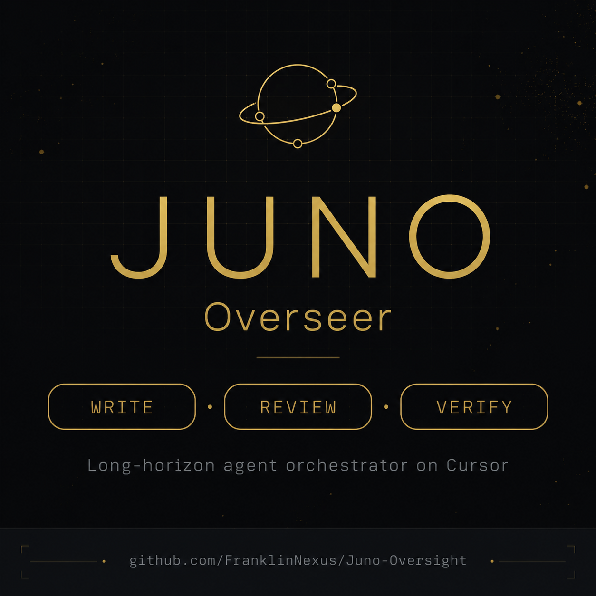

<p align="center">
  
</p>

<h1 align="center">Juno</h1>

<p align="center">
  <strong>A governed runtime for autonomous AI work.</strong><br />
  Submit a goal. Juno plans, executes, reviews, verifies, and returns auditable evidence.
</p>

<p align="center">
  
  
  
  
</p>

Juno sits between an AI model and your repository. The model still writes the work; Juno owns the queue,
scope, checkpoints, retries, independent review, verification, and terminal result.

```text
Natural-language goal
        |
        v
 plan -> implement -> review -> verify
        |             |          |
   checkpoint     PASS/REVISE   tests/build
        |             |          |
        +-------------+----------+
                      |
              machine-readable result
```

Juno is not another chat UI and not a multi-agent role-playing framework. It is the local runtime that
turns agent work into a bounded, replayable workflow.

## What ships

| Product surface | What it does |
|-----------------|--------------|
| Direct control CLI | Submit, observe, wait for, and evaluate missions without desktop automation |
| Mission runtime | Durable queue, scheduler, worker lifecycle, retries, and recovery |
| Oversight gates | Independent `PASS`, `REVISE`, or `BLOCK` review plus deterministic verify |
| Scope and safety | Per-mission scope locks, destructive-operation hooks, bounded autonomy |
| Evidence store | Mission state, checkpoints, event streams, gate reports, and final JSON |
| Desktop surface | Tauri/Next.js operational HUD for queue and mission visibility |

## Try it without an API key

Requirements: Windows 10/11, Node.js 22.13+, pnpm 10, Git, and Rust for the desktop verification gate.

```powershell
git clone https://github.com/FranklinNexus/Juno-Oversight.git
cd Juno-Oversight
pnpm install
pnpm juno:setup
pnpm juno:doctor
pnpm loop:smoke
```

`juno:setup` creates an empty workbench outside the repository, installs the safety hooks, writes local
runtime defaults, and records machine-specific paths in the gitignored `.env.local`. It is idempotent and
does not replace an existing queue or runtime state.

`loop:smoke` exercises the same dequeue, checkpoint, review, verify, and progress transitions as the Live
runtime without calling a model. It runs in a temporary isolated workbench and cannot replace the configured
Live queue or disable the Live scheduler.

## Run a real AI mission

Add `CURSOR_API_KEY` to `.env.local`, then verify Live readiness:

```powershell
pnpm juno:doctor -- --live
```

Submit a goal and wait for the governed result:

```powershell
node scripts/juno-control.mjs run `
  --brief "Audit this repository's release readiness and write docs/release-readiness.md; do not commit or push" `
  --timeout-ms 1800000
```

Progress is newline-delimited JSON on stderr. Stdout contains one final JSON document, so Codex and other
local agents can call Juno directly:

```json
{
  "ok": true,
  "outcome": "complete",
  "snapshot": {
    "missionStatus": "COMPLETE",
    "phaseDone": 4,
    "phaseTotal": 4,
    "gates": { "review": "PASS", "verify": "PASS" },
    "queueDepth": 0,
    "activeRunStatus": "idle",
    "workerRunning": false
  }
}
```

### Control commands

```powershell
node scripts/juno-control.mjs status
node scripts/juno-control.mjs submit --brief "your task"
node scripts/juno-control.mjs wait --mission <mission-id>
node scripts/juno-control.mjs run --file .\brief.md
```

Stable terminal exit codes: `0` complete, `2` blocked, `3` failed, `4` timeout, `5` missing mission, and
`64` invalid input. The control surface is local-only; it does not expose an unauthenticated HTTP port.

## What changes versus a direct agent

| Direct one-shot agent | Juno runtime |
|-----------------------|--------------|
| One model call owns implementation and its completion claim | Separate implement, review, and verify runs |
| Progress usually lives in chat context | Checkpoints and events persist on disk |
| Retry behavior is client-specific | Retry budget and terminal states are explicit |
| “Done” can mean the model stopped | Queue advances only after required evidence exists |
| Scope is prompt guidance | Scope lock is passed to every phase and reviewed for drift |
| Automation needs UI control or custom glue | Local JSON CLI submits and waits programmatically |

The tradeoff is deliberate: governed work uses more calls and takes longer than a one-shot prompt. The
benefit is not cheaper generation; it is stronger evidence, recoverability, and a smaller gap between
“the agent answered” and “the task is actually complete.”

A real product-readiness audit completed all four phases in 628.6 seconds with independent review and full
desktop verification. It returned `COMPLETE`, `4/4`, review `PASS`, verify `PASS`, an empty queue, and no
worker process left behind. See the
[governed audit](./docs/juno-governed-product-readiness-evaluation.md) and the measured
[direct-agent comparison](./docs/real-world-workflow-comparison.md).

## Runtime model

```text
Repository                         Workbench (outside git)
----------                         -----------------------
orchestrator/  policy + gates      queue/       ordered work
scripts/       control + setup     missions/    scope + progress
src-tauri/     desktop bridge      runs/        events + checkpoints
src/           operational HUD     state/       scheduler + worker state
config/        safe examples       config/      local runtime policy
```

Each natural-language mission gets:

1. `north-star.md`: the intended outcome.
2. `scope-lock.md`: allowed and forbidden changes.
3. `p01-plan`: an execution plan and change list.
4. `p02-implement`: the scoped implementation.
5. `p03-review`: independent drift and quality judgment.
6. `p04-verify`: tests, lint, build, and task-specific checks.

The scheduler only marks the mission `COMPLETE` after every required phase reaches `done`.

## Operate Juno

| Goal | Command |
|------|---------|
| Initialize or repair local structure | `pnpm juno:setup` |
| Diagnose this machine | `pnpm juno:doctor` |
| Start the single scheduler | `pnpm juno:daemon` |
| Install scheduler at Windows logon | `pnpm juno:autonomy:install` |
| Run the desktop HUD | `pnpm tauri:dev` |
| Run the browser surface | `pnpm dev` |
| Inspect API quota state | `pnpm api:quota` |
| Run every desktop quality gate | `pnpm verify:desktop` |
| Safely purge old temporary runs | `pnpm workbench:purge` |

The scheduler is single-instance. `juno:control run` starts it when needed and restores a paused scheduler.
At Windows logon, Juno uses Task Scheduler when permitted and a per-user Startup shortcut otherwise.

## Safety defaults

- Workbench state is outside the repository and is never committed.
- `.env.local` is gitignored; diagnostics report key presence but never key content.
- Promote requires human confirmation by default.
- Auto-push is opt-in per brief and configuration.
- Review can block scope drift or request a revise slot.
- Cursor hooks reject destructive commands and Vault writes outside the configured boundary.
- API limits bound concurrency, request rate, retry backoff, and daily token use.

Juno is not a general-purpose sandbox. Use a dedicated branch and workbench, protect production secrets,
and review unattended mission permissions. See [SECURITY.md](./SECURITY.md).

## Product status

Juno is a developer preview, currently tested on Windows. The runtime, direct control path, scheduler,
oversight gates, setup/doctor flow, desktop build, and local CI-equivalent gates are functional. GitHub
Actions defines the same Windows gate; release evidence depends on a green run for the candidate commit.
Packaging, signed desktop releases, multi-user authentication, and polished visual design are not yet
release-grade.

This repository does not claim open-ended AGI or that deterministic gates make model output deterministic.
Juno makes the workflow around probabilistic models explicit and inspectable.

## Development

```powershell
pnpm verify:desktop
cargo test --manifest-path src-tauri/Cargo.toml
```

The desktop gate runs unit tests, lint, the Next.js production build, a Turbopack smoke test, orchestrator
build, and Cargo check. CI runs the same gate on Windows and adds Rust tests.

## Documentation

| Need | Document |
|------|----------|
| First installation and troubleshooting | [docs/getting-started.md](./docs/getting-started.md) |
| Direct control JSON contract | [docs/juno-direct-control.md](./docs/juno-direct-control.md) |
| Real end-to-end acceptance record | [docs/juno-direct-control-e2e.md](./docs/juno-direct-control-e2e.md) |
| Governed product-readiness audit | [docs/juno-governed-product-readiness-evaluation.md](./docs/juno-governed-product-readiness-evaluation.md) |
| Direct vs governed real-world comparison | [docs/real-world-workflow-comparison.md](./docs/real-world-workflow-comparison.md) |
| Pre-fix direct-agent audit | [docs/direct-agent-baseline-evaluation.md](./docs/direct-agent-baseline-evaluation.md) |
| Runtime state and module map | [wiki/runtime.md](./wiki/runtime.md) |
| Oversight gate specification | [wiki/overseer-quality.md](./wiki/overseer-quality.md) |
| Configuration reference | [config/README.md](./config/README.md) |
| Security and contribution policy | [SECURITY.md](./SECURITY.md) · [CONTRIBUTING.md](./CONTRIBUTING.md) |
| Release history | [CHANGELOG.md](./CHANGELOG.md) |

## License

[MIT](./LICENSE) © 2026 FranklinNexus.
