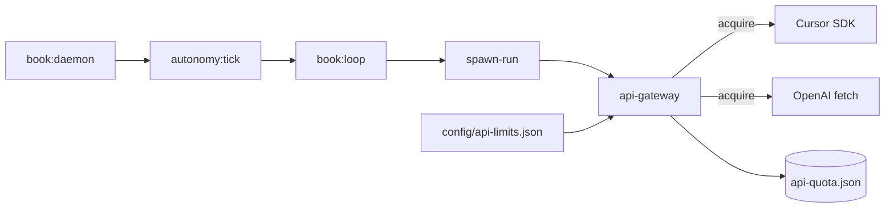

# API Gateway — 限速、配额、退避

Juno 所有 **Live API**（Cursor Composer、`api_token`/OpenAI、未来 Anthropic 等）统一经 `orchestrator/src/api-gateway.ts` 调度，避免 burst 触发 429、并发打满、或 overnight mission 自毁。

---

## 1. 公理之书容量估算

| 项 | 数值 |
|----|------|
| Live slot 数 | **42**（20 写 + 20 审 + 2 debate） |
| 每 slot 输入+输出 token（估） | 写 ~35k，审 ~18k，均 ~**26k** |
| **全书 token 合计** | **~1.09M** |
| 每 slot 墙钟时间（估） | 25–45 min |
| **全书墙钟（串行）** | **~18–30 h** |

### 与默认 Cursor 限额对比

| 限额 | 默认 | 全书需求 | 结论 |
|------|------|----------|------|
| maxRpd | 400 req/天 | 42 req | ✅ 够 |
| maxRph | 100 req/h | ~2 req/h 均速 | ✅ 够 |
| maxRpm | 8 req/min | 串行 1 | ✅ 够 |
| tokenBudgetDaily | 2.5M | ~1.1M | ✅ 够（可调） |
| maxConcurrent | 1 | 1 | ✅ 匹配 daemon |

**瓶颈是墙钟与单 slot 质量，不是 RPM**——gateway 保证不会因 burst 自触发 429。

---

## 2. 架构



**Provider 映射**

| manifest.provider | gateway id |
|-------------------|------------|
| `cursor_composer` | `cursor` |
| `api_token` + openai | `openai` |
| `api_token` + anthropic | `anthropic` |
| 其他 | `generic` |

---

## 3. 配置

Workbench：`AgentWorkbench/config/api-limits.json`（见仓库 `config/api-limits.example.json`）

```json
{
  "providers": {
    "cursor": {
      "minIntervalMs": 8000,
      "maxRpm": 8,
      "maxRph": 100,
      "maxRpd": 400,
      "maxConcurrent": 1,
      "tokenBudgetDaily": 2500000
    }
  },
  "missions": {
    "juno-axiom-book-2026": {
      "estimatedLiveSlots": 42,
      "estimatedTokensPerSlot": 26000
    }
  }
}
```

| 字段 | 含义 |
|------|------|
| `minIntervalMs` | 两次请求最小间隔 |
| `maxRpm` / `maxRph` / `maxRpd` | 滑动窗口上限 |
| `maxConcurrent` | 同 provider 并行 inflight |
| `tokenBudgetDaily` | 日 token 软预算（0=关闭） |
| `backoffBaseMs` / `backoffMaxMs` | 429/5xx 指数退避 |

---

## 4. 429 / 限速行为

1. **主动**：`acquireApiSlot` 在发请求前检查窗口 → 返回 `waitMs`
2. **被动**：HTTP 429 / `Retry-After` / `CursorAgentError.retryable` → `recordApiFailure` 写 `backoffUntil`
3. **spawn-run**：`waitForApiSlot` 最多等 15 min 再调 SDK
4. **daemon**：tick 前若 backoff 未清，sleep 至 backoff + interval

---

## 5. 命令

```bash
pnpm api:quota          # 查看 quota / mission 容量
pnpm book:loop:tick     # 经 gateway 的 Live 写章
```

状态文件：`AgentWorkbench/state/api-quota.json`

---

## 6. 扩展新 API

1. 在 `DEFAULT_LIMITS` 加 provider 或使用 `config` 的 `"*"` 通配
2. `resolveProviderId()` 映射新 `manifest.provider`
3. 在对应 runner（如 `spawn-run` / 新 `anthropic.ts`）里 `waitForApiSlot` + `releaseApiSlot`

无需改 book daemon / mission 队列。
