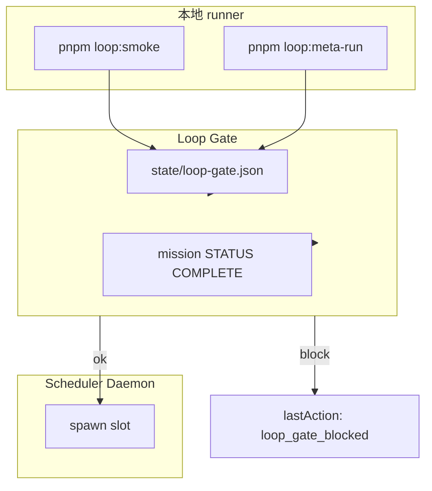

# Loop 自指 — 架构闭环

**Mission**：`juno-loop-meta-2026`（已完成）  
**Smoke**：`juno-smoke-loop-2026`（已完成）

---

## 1. 自指 loop 是什么

Overseer 用 **同一套门禁**（implement → review → verify）来：

1. 验证最小交付（smoke）
2. 改进跑 loop 的代码本身（meta）
3. **守门** 24/7 Scheduler（可选 loop gate）



---

## 2. 关键组件

| 组件 | 路径 | 作用 |
|------|------|------|
| `run-minimal-loop.mjs` | `scripts/` | 本地三 slot + 真实 verify + 出队 |
| `queue-io.ts` | `orchestrator/src/` | YAML 读写（CRLF 安全） |
| `promote-queue.ts` | `orchestrator/src/` | backlog → now（文献恢复） |
| `loop-gate.ts` | `orchestrator/src/` | Scheduler spawn 前门禁 |
| `restore-literature-queue.mjs` | `scripts/` | 文献 Mission 回 now |

---

## 3. 命令

```bash
pnpm loop:smoke              # smoke mission 全流程
pnpm loop:meta               # 排队 meta mission
pnpm loop:meta-run           # 跑 meta 三 slot
pnpm loop:self-iterate       # 排队 P0 自迭代 mission
pnpm loop:self-iterate-run   # 跑自迭代三 slot（本地）
pnpm queue:restore-literature   # 文献 ar04–ar11 → now
```

---

## 4. Loop Gate（Scheduler 前置）

默认 **不拦截**（`config.yaml` → `scheduler.require_loop_gate: false`）。

启用任一方式：

| 方式 | 效果 |
|------|------|
| `JUNO_REQUIRE_LOOP_GATE=1` | 环境变量强制 |
| `scheduler.require_loop_gate: true` | Workbench config |
| `JUNO_SKIP_LOOP_GATE=1` | 跳过（紧急） |

通过条件（满足其一）：

1. `juno-smoke-loop-2026` + `juno-loop-meta-2026` 的 mission checkpoint 均含 `STATUS: COMPLETE`
2. `state/loop-gate.json` 在 **24h** 内（`pnpm loop:smoke` 自动写入）

未通过时 Scheduler `lastAction: loop_gate_blocked`，不 spawn。

---

## 5. 文献 Mission

Mission `juno-agent-literature-2026` **已完成**（100 篇 + [juno-agent-architecture.md](./juno-agent-architecture.md)）。

若队列被 smoke/meta 清空，可恢复：

```bash
pnpm queue:restore-literature
```

将 ar04–ar11 移回 `now:`，并备份 `now.yaml.bak-restore-lit-*`。

---

## 6. 与 Scheduler 的关系

| 模式 | 何时用 |
|------|--------|
| **本地 runner** | CI、调试、无 API Key |
| **Scheduler + loop gate** | 24/7 前确保 loop 绿 |
| **Scheduler 无 gate** | 本地试验 Live Agent |

共享：`evaluateCompletedRun`、`shouldMarkPhaseDone`、`queue-io`。

---

## 7. 演进路线图

| 阶段 | 状态 |
|------|------|
| smoke + meta 本地 runner | **完成** |
| queue-io 共用 + CRLF 修复 | **完成** |
| loop gate + 文献恢复 | **完成** |
| 文献 100 篇 + 架构 wiki | **完成** |
| P0 自迭代（workflow + events + eval） | **完成** — `pnpm loop:self-iterate-run` |
| P1 自迭代（safety + DAG + wiki promote） | **完成** — `pnpm loop:self-iterate-p1-run` |
| P2 + bounded autonomy + AGI scaffold | **完成** — `pnpm loop:self-iterate-p2-run` |
| AGI 1000 篇 + north-star 定稿 | **完成** — `pnpm agi:loop` |
| 公理之书实验 | **完成** — `pnpm book:loop` |
| API Gateway + self-optimize | **完成** — `pnpm self:optimize` · [juno-self-optimize.md](./juno-self-optimize.md) |
| Von Neumann 自指单元 v0–v1 | **完成** — fitness + planner 反馈 · [juno-von-neumann-unit.md](./juno-von-neumann-unit.md) |
| Overseer Hardening h01–h11 | **完成** — verify:desktop PASS · promote preview |
| CI 跑 `pnpm loop:smoke` | 待接 |
| Tauri 启 daemon 前 UI 提示 gate | 待接 |

详见 [orchestrator.md](./orchestrator.md)、[workbench.md](./workbench.md)。

---

## 8. 自迭代 Mission（P0）

Mission `juno-self-iterate-2026` 落地文献架构 **P0**：workflow 版本库、`events.jsonl` 契约、eval profile。

```bash
pnpm loop:self-iterate        # 仅排队（备份当前 now.yaml）
pnpm loop:self-iterate-run    # 排队 + 本地三 slot（真实 test + orchestrator:build）
```

| 组件 | 路径 |
|------|------|
| Workflow JSON | `orchestrator/workflows/{default,meta-loop,self-iterate}.json` |
| 加载器 | `orchestrator/src/workflow.ts` |
| Eval profile | `orchestrator/src/eval-profile.ts` → manifest `evalProfile` |
| Events 契约 | `orchestrator/src/events-schema.ts` |

**Live Agent 迭代**（Scheduler spawn 真实 Cursor slot）：

1. `pnpm loop:self-iterate` 排队
2. Workbench `state/scheduler.json` → `"enabled": true`（可选 `JUNO_REQUIRE_LOOP_GATE=1`）
3. `pnpm orchestrator:build` 后启动 daemon / Tauri Overseer 面板
4. 每 slot 由 `spawn-run` 写 `runs/<id>/events.jsonl`（可用 `handoff` / `verdict` event）

本地 runner **不消耗 API**；implement/review 为交付物门禁，verify 跑 `orchestrator` profile（test + build + deps，跳过 ui:smoke）。

---

## 9. 自迭代 P1

Mission `juno-self-iterate-p1-2026`：Safety verify bundle、`depends_on` phase DAG、Mission COMPLETE → wiki。

```bash
pnpm loop:self-iterate-p1-run
pnpm promote:mission-wiki juno-self-iterate-2026   # 手动 promote
```

| 组件 | 路径 |
|------|------|
| Safety bundle | `orchestrator/src/safety-verify.ts` |
| Phase DAG | `orchestrator/src/phase-dag.ts` |
| Skill wiki | `scripts/promote-mission-wiki.mjs` → `wiki/mission-patterns.md` |

---

## 10. 自迭代 P2（OPRO + debate）

Mission `juno-self-iterate-p2-2026`：四 slot **implement → debate → review → verify**。

```bash
pnpm loop:self-iterate-p2-run
```

| 组件 | 路径 |
|------|------|
| Workflow 搜索 | `orchestrator/src/workflow-search.ts` |
| Debate slot | `RunKind: debate` |
| P2 workflow | `orchestrator/workflows/self-iterate-p2.json` |

---

## 11. 受限自决策（Bounded Autonomy）

见 [juno-bounded-autonomy.md](./juno-bounded-autonomy.md)。

```bash
pnpm autonomy:tick              # dry-run 决策
pnpm autonomy:tick --execute    # 执行（P2 完成后自动 queue AGI 文献）
```

---

## 12. AGI 1000 篇 Mission

Mission `juno-agi-literature-2026` → [juno-agi-north-star.md](./juno-agi-north-star.md)。

```bash
pnpm queue:agi-literature       # ag00–ag02 now，其余 backlog（83 phases）
pnpm queue:restore-agi          # 恢复 backlog → now
```

**路线**：1000 篇分批（40×25）→ synthesis 定稿初步 AGI 栈 → 再开下一轮 self-iterate 实现。

### 自循环（无需每次说「继续」）

```bash
pnpm agi:loop              # 单次最多出队 20 slot（缺 batch 则停）
pnpm agi:loop:tick           # bounded-autonomy 决策 + 执行 agi:loop
pnpm agi:loop --max-slots=30
```

状态：`AgentWorkbench/state/agi-loop.json`（`blocked_missing_batch` 时需 Live implement 或预写 YAML）。
