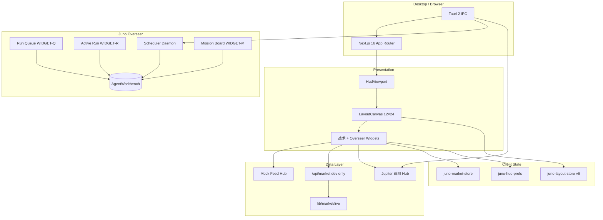

# Juno Oversight HUD — 产品白皮书

**版本**：0.1.x（Phase 1–2 + Overseer + 行情 LIVE dev）  
**最后更新**：2026-07-01（第七轮 — 120% Wiki 对齐）

---

## 1. 愿景

Juno Oversight 是一款**高信息密度、机构终端风格**的桌面战术看板（HUD），并内嵌 **Juno Overseer** 编排层，用于长任务 implement → review → verify 的 24/7 自动化。

目标用户：

- 需要同时监视 **多市场行情**、**研发信号（GitHub）**、**边缘节点（Jupiter）**
- 需要 **Agent Workbench** 队列、Mission、Promote 而不离开 HUD
- 需要 **Review 门禁** 与 **破坏性操作防火墙** 的 builder 与小团队

设计参照：

- **信息架构**：wtfutil 式模块化 + 可编排网格
- **视觉纪律**：Bloomberg 类深色终端、低装饰、高对比数据层
- **编排纪律**：Scope Lock + checkpoint 记忆 + REVIEW_VERDICT 出队

---

## 2. 设计原则

| 原则 | 说明 |
|------|------|
| 数据优先 | 数字、表格、深度、sparkline 优先于装饰性 UI |
| 单屏高密度 | 默认 1440×900 逻辑画布，FIT 缩放 75%–135% |
| 插件式 Widget | 10 种模块经 `widget-registry` 注册（见 [widgets.md](./widgets.md)） |
| 双轨运行 | 浏览器 mock 开发 + Tauri 桌面真实探针 |
| Overseer 同屏 | Run Queue / Active Run / Scheduler / Mission / Promote 与战术窗共存 |
| 组件库统一 | HUD 样式经 `@/components/ui` |
| 主题 | **夜间** / **土星金** / **日间**；顶栏循环切换 |
| 行情交互 | 点击行 / 搜索 → 详情窗；同标的 **去重置顶** |
| 行情源 | 顶栏 **LIVE / MOCK**；LIVE dev = Binance + Yahoo（经 Route Handler 代理） |

---

## 3. 系统架构



### 3.1 Widget 模块（10 个）

详见 [widgets.md](./widgets.md)。

**Overseer（6）**

| 代号 | type | 职责 |
|------|------|------|
| WIDGET-Q | runqueue | 显示 `queue/now.yaml` |
| WIDGET-D | daily | Daily Digest |
| WIDGET-R | activerun | Spawn Dry/Live、Kill |
| WIDGET-S | daemon | 24/7 Scheduler 启停 |
| WIDGET-M | mission | Mission phase 看板 |
| WIDGET-P | promote | staging → Vault |

**战术（4）**

| 代号 | type | 职责 | 数据源 |
|------|------|------|--------|
| WIDGET-A | market | 自选、搜索、K线/MACD | LIVE 或 Mock |
| WIDGET-B | github | 仓库事件流 | Mock WS |
| WIDGET-C | infra | SSH/NPU/延迟 | Tauri 或 mock |
| WIDGET-D2 | appslot | 第三方 iframe 位 | 占位 |

### 3.2 Overseer 数据流

```text
queue/now.yaml → Scheduler → spawn-run → checkpoint.md + events.jsonl
                    ↓
         REVIEW_VERDICT / VERIFY_REPORT
                    ↓
            resolveQueueAdvance → 出队
                    ↓
         missions/*/progress.md (phase done)
```

权威文档：[orchestrator.md](./orchestrator.md)、[workbench.md](./workbench.md)、[overseer-quality.md](./overseer-quality.md)。

### 3.3 全局模式

- **Omni-Surveillance**：更高刷新、更多 Ticker/深度行
- **Deep Focus**：过滤噪音、减少行数

### 3.4 布局与窗口交互

| 能力 | 行为 |
|------|------|
| 网格 | 12 列 × **24 行**；允许重叠；`compactType: null` |
| 弹出窗 | 默认右侧 5×14；`stackOrder`；同 `pinnedSymbol` 只保留一个 |
| 拖拽 | 整条 panel-chrome；仅松手落盘 |
| 全局缩放 | `HudViewport` + `createHudScaledStrategy(uiScale)` |
| 窗内缩放 | 标题栏滚轮 75%–150%；Shift/Ctrl+滚轮调格高宽 |
| 布局预设 | Default Quad / Overseer Quad / Trading Focus 等 |

持久化：`juno-layout-store` **v6**（含 `contentZoom`、`pinnedSymbol`、`stackOrder`）。

---

## 4. 行情 LIVE / MOCK

| 模式 | 环境 | 行为 |
|------|------|------|
| **MOCK** | dev + Tauri 静态包 | Mock WebSocket |
| **LIVE dev** | `pnpm dev` | `GET /api/market/quotes` + `/klines` → `lib/market/live/*` |
| **LIVE 桌面包** | `pnpm build` 静态 export | **无 Route Handler**；切 MOCK 或外置代理（Phase 3） |

| 市场 | LIVE 源 | 盘口 |
|------|---------|------|
| Crypto | Binance REST | Binance depth（≤3 标的） |
| US / HK / A | Yahoo Finance | 合成五档 |

---

## 5. 技术栈

| 层 | 选型 |
|----|------|
| UI | React 19, Next.js 16, Tailwind CSS 4 |
| 状态 | Zustand persist + migrate |
| 桌面 | Tauri 2, sysinfo |
| 网格 | react-grid-layout v2 |
| 图表 | lightweight-charts 5 |
| 编排 | Node 22 orchestrator + `@cursor/sdk` |

### 5.1 构建双模式

- **开发**：`pnpm dev` / `pnpm tauri:dev` — 无 `output: export`；可有 `/api/market`
- **发布**：`pnpm build` — `output: "export"` → `out/` → Tauri `frontendDist`

详见 [maintenance.md §3](./maintenance.md#3-next-配置要点必读)。

---

## 6. 路线图

### 已完成

- Bento 多窗、Omni/Focus、Mock 行情与 GitHub
- Tauri 系统指标、Jupiter stub、UI Kit、`/dev/components`
- Overseer 六窗 + Scheduler + Review 门禁 + destructive hook
- Smoke loop Mission + `pnpm ui:smoke`
- LIVE dev 代理（`lib/market/live` + Route Handler）
- Wiki 120%（orchestrator / workbench / widgets）

### Phase 3（进行中）

- Tauri 静态包行情代理或客户端直连策略
- GitHub App / PAT；Jupiter SSH 真实探针
- Widget D2 iframe + CSP
- E2E、多 workspace 命名

### 非目标（当前）

- 券商级下单与合规报单
- 多用户云端同步
- 移动端优先

---

## 7. 成功指标

- 单屏 4+ 模块可读，无关键数字溢出
- Overseer：Review BLOCK 不出队；destructive shell 被 hook 拦截
- 桌面 CPU/RAM 与顶栏一致；布局重启可恢复
- Smoke loop 三 slot 可重复 dry 模拟 + ui:smoke PASS

---

## 8. 文档索引

| 文档 | 内容 |
|------|------|
| [wiki/README.md](./README.md) | Wiki 总索引 |
| [widgets.md](./widgets.md) | 10 Widget + Tauri IPC |
| [orchestrator.md](./orchestrator.md) | Scheduler / spawn-run |
| [workbench.md](./workbench.md) | AgentWorkbench 目录 |
| [overseer-quality.md](./overseer-quality.md) | Review / Verify 权威 |
| [smoke-loop.md](./smoke-loop.md) | 最小 loop 试跑 |
| [maintenance.md](./maintenance.md) | 命令、排错、测试 |
