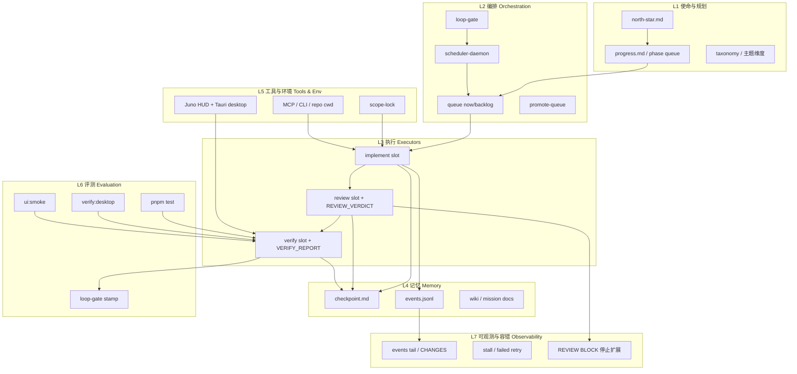

# Juno Agent 架构 — 文献归纳与迭代建议

**Mission**：`juno-agent-literature-2026`  
**最后更新**：2026-06-01  
**依据**：100 篇 auto-agent 论文（见 [agent-literature-index.md](./agent-literature-index.md)）+ 现有 Loop 自指栈（[architecture-loop.md](./architecture-loop.md)）

---

## 1. 结论摘要

文献与 Juno 实践对齐后的核心判断：

| 判断 | 说明 |
|------|------|
| **Juno 已覆盖主流骨架** | implement → review → verify 三态、外部 checkpoint 记忆、scope-lock 沙箱、评测门禁，对应 ReAct / Reflexion / SWE-bench 范式 |
| **最大缺口在「可进化编排」** | AFlow、ADAS、OPRO、Flow 等强调 **工作流搜索与 meta-design**；Juno 已有 meta loop + loop-gate，但缺少 **结构化 workflow 版本库与自动 A/B** |
| **多 Agent 已「角色化」但未「协议化」** | AutoGen / MetaGPT / DyLAN 强调角色与消息总线；Juno 用 slot kind 区分角色，但 **events.jsonl 尚未成为机器可读的 A2A 契约** |
| **安全与红队需前置** | AgentHarm、AgentDojo、ST-WebAgentBench 表明 **prompt 注入与越权工具** 是生产风险；scope-lock + Promote 是正确方向，需 **verify 阶段注入 safety case** |
| **GUI/OS Agent 文献爆发** | OSWorld、UFO、Cradle 等；Juno HUD + Tauri 天然是 **human-facing environment**；Overseer 应把 **ui:smoke** 视为一等环境 benchmark |

---

## 2. 推荐分层架构（文献 → Juno 映射）

---

## 3. 文献模式 → Juno 组件对照表

| 文献模式 | 代表论文 (#) | Juno 现有 | 缺口 / 建议 |
|----------|--------------|-----------|-------------|
| **Think–Act 交错** | ReAct (#1), Toolformer (#4) | implement slot + 工具调用 | 在 checkpoint 强制 **action log** 小节，便于 review 追溯 |
| **Critic / Verifier loop** | Reflexion (#2), Self-Refine (#12), CRITIC (#13) | executor_review + REVIEW_VERDICT | REVISE 应 **prepend fix slot** 并写 reflexion 到 events（已有 partial） |
| **层级规划** | ToT (#11), LATS (#21), Plan-and-Solve (#33) | north-star + phase queue | 大 Mission 可嵌 **子 DAG**（backlog 树形），非仅线性 now |
| **多 Agent 编排** | AutoGen (#5), MetaGPT (#6), ChatDev (#18) | implement/review/verify 三角色 | 增加 **structured handoff** schema（JSON block in events） |
| **外部记忆** | MemGPT (#16), Generative Agents (#3), ExpeL (#31) | checkpoint 唯一记忆 | 区分 **episodic**（events）vs **semantic**（wiki）；禁止 slot 内隐式记忆 |
| **代码 / SWE Agent** | SWE-agent (#8), OpenHands (#30), SWE-bench (#20) | repo-scoped implement | verify 默认跑 **test + lint**；大改 Mission 加 **SWE-bench 子集** |
| **Web / GUI 环境** | WebArena (#10), OSWorld (#36), UFO (#53) | ui:smoke + Tauri | 扩展 smoke 覆盖 **Overseer Widget 关键路径**（已有方向） |
| **Benchmark 门禁** | AgentBench (#9), AgentBoard (#81), PaperBench (#88) | pnpm test + verify:desktop | 按 Mission 类型挂载 **benchmark profile**（文献 / code / UI） |
| **安全红队** | AgentDojo (#60), AgentHarm (#86), GuardAgent (#69) | scope-lock, §11 防火墙 | verify slot 增加 **readonly safety checklist**（注入/越权路径） |
| **人在回路** | WebGPT (#25), τ-bench (#59), CollabLLM (#70) | Promote 面板 | BLOCK/REVISE 时 **显式等待 promote** 可选模式 |
| **工作流自优化** | AFlow (#62), ADAS (#97), OPRO (#98), Flow (#99) | loop:meta-run, meta mission | 存 **workflow YAML 版本** + meta slot 只改 orchestrator |
| **Skill / 经验库** | Voyager (#7), Skill Library (#93) | wiki 累积 | Mission 完成时 **promote patterns → wiki**（本文即范例） |

---

## 4. 与 Loop 自指栈的关系

[architecture-loop.md](./architecture-loop.md) 已实现的 **自指闭环** 在文献中有直接对应：

| Juno 机制 | 文献锚点 | 迭代含义 |
|-----------|----------|----------|
| `pnpm loop:smoke` | AgentBench / SWE-bench 最小回归 | Smoke = **canary**；失败则 block scheduler |
| `pnpm loop:meta-run` | ADAS / AFlow / OPRO | Meta = **搜索更好 orchestrator**；应版本化 diff |
| `loop-gate.json` | SafeAgentBench / ST-WebAgentBench | Gate = **部署前安全+质量双签** |
| `queue:restore-literature` | 本 Mission 100 篇 | 证明 **backlog→now promote** 可恢复长任务 |

**反思**：Juno 的 loop 不是「单 Agent 自反思」，而是 **系统级 orchestrator-workers**（Anthropic 工程实践与 Flow #99 一致）—— implement 工人、review 批评者、verify 测试者分离，checkpoint 为共享黑板。这与 Reflexion 的「 verbal RL 」同构，但 **角色物理隔离** 更利于 audit。

---

## 5. 架构缺口（优先级）

### P0 — 下一迭代应做

1. **Workflow 版本库** — 存 `orchestrator/workflows/*.yaml`（phase 图 + prompt 模板 hash）；meta loop 只提交可 diff  artifact（ADAS #97, AFlow #62）。
2. **events.jsonl 契约** — 定义 `handoff`, `verdict`, `tool_call`, `reflexion` 四类 event；对齐 AutoGen / CAMEL 的消息语义（#5, #14）。
3. **Benchmark profile** — Mission manifest 增加 `eval_profile: code | ui | literature`；verify 自动选命令集（AgentBench #9, AgentBoard #81）。

### P1 — 中期

4. **Safety verify bundle** — 只读扫描：scope 违规路径、secret 模式、destructive 命令（AgentDojo #60, GuardAgent #69）。
5. **嵌套 planning** — backlog 支持子 Mission 或 phase 依赖 DAG（MetaGPT #6, LATS #21）。
6. **Skill wiki 管道** — Mission COMPLETE → 自动 PR 更新 `wiki/` 模式库（Voyager #7, ExpeL #31）。

### P2 — 研究向

7. **Workflow 搜索** — OPRO 式 prompt/queue 模板优化（#98），在 Workbench 沙箱跑 A/B。
8. **Multi-agent 扩展 slot** — 可选 `debate` / `vote` kind（DyLAN #66, MultiAgentBench #85）。

---

## 6. 主题覆盖度（100 篇）

完整统计见 [agent-literature-index.md §主题分布](./agent-literature-index.md#主题分布篇次可重复计数)。摘要：

| 主题 slug | 篇次 | Juno 映射强度 |
|-----------|------|---------------|
| environment | 32 | 强（HUD/Tauri/ui:smoke） |
| tools | 30 | 强（scope-lock/MCP） |
| evaluation | 29 | 强（test/verify/smoke） |
| planning | 25 | 中（线性 phase；缺 DAG） |
| self-improvement | 19 | 中（REVISE/meta loop） |
| orchestration | 19 | 强（scheduler/queue） |
| multi-agent | 18 | 中（三 slot 角色化） |
| memory | 9 | 中（checkpoint；缺分层） |
| safety | 6 | 中（scope；缺 red-team case） |
| verification | 4 | 强（REVIEW_VERDICT） |
| human-in-loop / retrieval / communication | 各 4 | 中–弱 |
| observability | 3 | 中（events；缺 trace UI） |
| efficiency | 2 | 弱（ReWOO 式 planner/worker 可加强） |
| resilience | 1 | 中（stall retry） |

---

## 7. 推荐精读清单（10 篇 → 直接指导 Overseer）

| # | 论文 | 为何 |
|---|------|------|
| 1 | ReAct | Think–act 基线；implement prompt 结构 |
| 2 | Reflexion | REVISE 循环的理论依据 |
| 8 | SWE-agent | Repo agent 界面设计 |
| 9 | AgentBench | 多域 eval 设计 |
| 16 | MemGPT | 外部记忆 / checkpoint 哲学 |
| 20 | SWE-bench | Code verify 黄金标准 |
| 62 | AFlow | 工作流自动生成 → meta loop |
| 69 | GuardAgent | 护栏 Agent → review 增强 |
| 81 | AgentBoard | 多轮 trace → events 设计 |
| 97 | ADAS | 编排系统 meta-design |

---

## 8. 本文档与代码边界

- **Scope-lock**：本 Mission **未改** `src/**` 与 orchestrator 依赖；以上为 **架构建议**，落地需独立 implement Mission。
- **真源顺序**：行为以 `orchestrator/src/` + [overseer-quality.md](./overseer-quality.md) 为准；本文档为文献驱动的 **设计 north-star**。
- **关联**：[runtime.md](./runtime.md) · [architecture-loop.md](./architecture-loop.md) · [agent-literature-index.md](./agent-literature-index.md)
