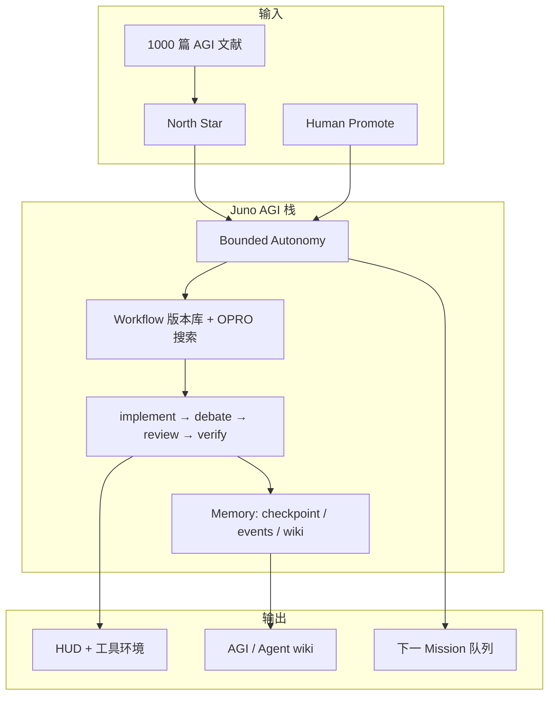

# Juno 初步 AGI 架构 — North Star

**Mission**：`juno-agi-literature-2026`（目标 **1000 篇** → 本文件迭代）  
**最后更新**：2026-07-01  
**状态**：1000 篇完成 — synthesis 版（batch-01..40 + 本 wiki）

---

## 1. 定义：Juno 语境下的「初步 AGI」

不是单模型 AGI，而是 **可自指改进的 Overseer 系统**：

| 能力 | Juno 对应 |
|------|-----------|
| 长期目标 | Mission north-star + phase queue |
| 行动 | implement / review / verify / debate |
| 记忆 | checkpoint + events + wiki skill 库 |
| 工具 | scope-lock + MCP + repo |
| 自我改进 | P0–P2 self-iterate + workflow-search |
| **限制** | [bounded-autonomy](./juno-bounded-autonomy.md) |



---

## 2. 分层（文献综合 → 组件）

| 层 | AGI 文献主题 | Juno 组件 | 缺口 |
|----|--------------|-----------|------|
| L0 目标 | Levels of AGI | mission north-star | 缺量化 level 指标 |
| L1 决策 | Constitutional / RLHF | bounded-autonomy | 需 UI 审批面板 |
| L2 规划 | ToT / JEPA / MetaGPT | phase DAG + backlog | 缺跨 Mission 规划 |
| L3 执行 | ReAct / tools / computer use | executor slots | 已覆盖 |
| L4 推理 | CoT / o1 / debate | **debate slot** (P2) | 需 live 多轮 |
| L5 记忆 | MemGPT / Generative Agents | checkpoint + events | 缺向量 RAG |
| L6 对齐 | CAI / DPO / safety | safety-verify + scope | 缺 red-team 套件 |
| L7 评测 | MMLU / GAIA / AgentBench | eval_profile | 缺 GAIA 子集 |
| L8 缩放 | Scaling laws | max_minutes / 日迭代上限 | 已部分覆盖 |

---

## 3. 1000 篇文献路线

| 批次 | 编号 | 主题侧重 |
|------|------|----------|
| batch-01–10 | 1–250 | 基础：对齐、推理、缩放、工具 |
| batch-11–20 | 251–500 | Agent / 多智能体 / 环境 |
| batch-21–30 | 501–750 | 世界模型 / 机器人 / 多模态 |
| batch-31–40 | 751–1000 | 评测 / 经济 / 风险 / 综合 |

数据：`AgentWorkbench/missions/juno-agi-literature-2026/papers/batch-*.yaml`

命令：

```bash
pnpm queue:agi-literature      # 排队 ag00 + backlog
pnpm queue:restore-agi           # backlog → now
```

---

## 4. 受限自迭代（与 AGI 的关系）

**原则**：读文献 → 改架构 wiki → **小步实现 P0/P1/P2** → 再读下一批 — 永不跳过 review/verify。

| 限制 | 值 |
|------|-----|
| 日自主迭代 | ≤3 (`bounded-autonomy.json`) |
| 自动排队 Mission | ≤2/日 |
| Scheduler | 需 loop-gate |
| 禁止自动 | Vault 写、git destroy、force push |

自决策 tick：

```bash
pnpm autonomy:tick              # 仅打印决策
pnpm autonomy:tick --execute    # 执行（排队 AGI 或跑 P2 loop）
```

---

## 5. 完成定义（本 North Star）

- [ ] 1000 篇 YAML 条目核查通过
- [ ] 本文件 §2 映射表每行有文献 cite（batch 编号）
- [ ] mermaid 与 [juno-agent-architecture.md](./juno-agent-architecture.md) 一致
- [ ] `juno-agi-literature-2026` verify PASS

---

## 6. 关联

- [juno-von-neumann-unit.md](./juno-von-neumann-unit.md) — 自指进化 v0（fitness + 突变白名单）
- [juno-bounded-autonomy.md](./juno-bounded-autonomy.md)
- [juno-agent-architecture.md](./juno-agent-architecture.md)
- [architecture-loop.md](./architecture-loop.md)
