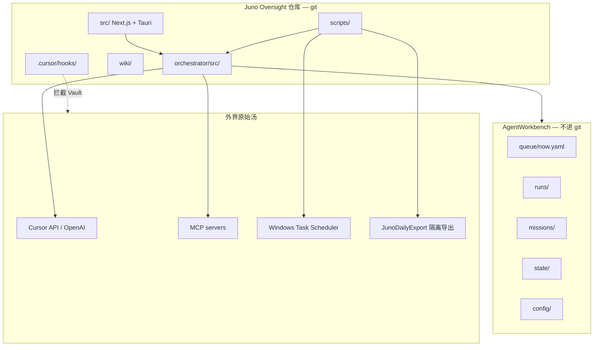
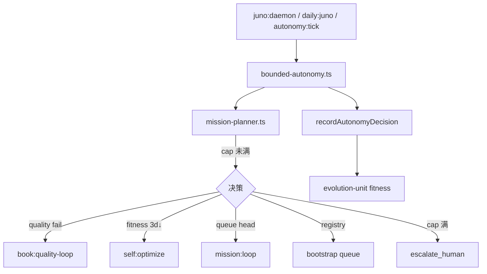
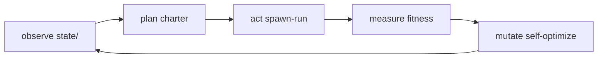
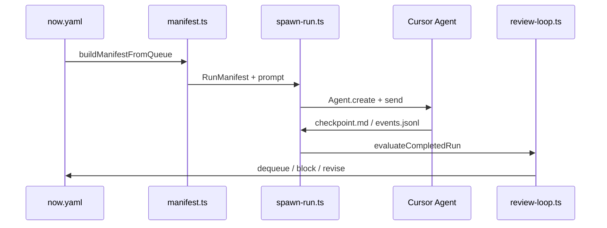

# Juno 系统架构 — 详细参考

**最后更新**：2026-07-03  
**代码真源**：`orchestrator/src/` · `scripts/` · `src/`（HUD）  
**状态**：Hardening mission **COMPLETE**（h01–h11）· Von Neumann v0–v1 **已落地**

---

## 1. 三层运行时



| 层 | 路径 | 职责 | 持久化 |
|----|------|------|--------|
| **HUD** | `src/` · `src-tauri/` | 战术看板、Promote 预览、Run 控制 | 无（读 Workbench 快照） |
| **Orchestrator** | `orchestrator/src/` | 队列、spawn、门禁、planner、fitness | 编译为 `orchestrator/dist/` |
| **Workbench** | `AGENT_WORKBENCH_ROOT` | 运行时 queue / runs / missions / state | 本地磁盘，daily export 备份 |
| **Safety** | `.cursor/hooks/` | Vault 只读、destructive ops 拦截 | 随仓库 |

环境变量：

| 变量 | 说明 |
|------|------|
| `JUNO_OVERSIGHT_ROOT` | 本仓库绝对路径 |
| `AGENT_WORKBENCH_ROOT` | Workbench 根（如 `E:\AgentWorkbench`） |
| `CURSOR_API_KEY` | Live Composer spawn |

---

## 2. 控制平面：Bounded Autonomy + Mission Planner

人只设 **章程**（`config/autonomy-charter.json`），不逐条 assign mission。



### 硬限制（`DEFAULT_AUTONOMY_LIMITS`）

| 参数 | 默认 | 说明 |
|------|------|------|
| `maxSelfIterationsPerDay` | 12 | 成功 tick 计数（Asia/Shanghai 日切） |
| `maxAutoQueueMissions` | 2 | 自动 bootstrap 新 mission / 日 |
| `requireLoopGateForScheduler` | true | 24/7 前须 smoke/meta 或 stamp |
| `allowedMissionIds` | 见代码 | charter 白名单 |

### Planner 优先级（摘要）

1. 日 cap → `escalate_human`
2. fitness 下降 + API backoff → `escalate_human`
3. fitness 连续 3 日下降 → `self:optimize`
4. 书稿 quality scan 失败 → `book:quality-loop`
5. 需要 self-optimize tick → `self:optimize`
6. **`now.yaml` 队列头** → `mission:loop` 或专用 loop
7. Registry（charter 排序）→ 继续 / bootstrap
8. auto-discover（progress 有 queued、队列为空）

详见 [juno-bounded-autonomy.md](./juno-bounded-autonomy.md)。

---

## 3. Von Neumann 自指单元（v0–v1）

**Mission 元数据**：`juno-von-neumann-unit-2026`（永不完结 · 度量进化）



| 概念 | 实现 |
|------|------|
| **控制器** | `mission-planner` + `bounded-autonomy` + `juno:daemon` |
| **度量器** | `evolution-unit.ts` → `evolution-fitness.json` + `evolution-log.jsonl` |
| **v1 反馈** | 连续 3 日 fitness↓ → planner 触发 `self:optimize` |
| **突变白名单** | `isMutationPathAllowed` — rubric / registry / mcp-hints 等 |
| **宪法** | `autonomy-charter.json`、Vault hooks — **不可自改** |

Fitness 公式（默认权重）：

```
score = -10×failedChapters + 5×hardeningDone + 2×capRatio + apiHealth(-20) - 3×idle
```

详见 [juno-von-neumann-unit.md](./juno-von-neumann-unit.md)。

---

## 4. 执行平面：Slot 流水线

每个 queue item 经 **materialize → spawn → evaluate → dequeue**：



| RunKind | 出队条件 | 失败行为 |
|---------|----------|----------|
| **implement** | `STATUS: COMPLETE` | hold → review |
| **review** | `REVIEW_VERDICT: PASS` | BLOCK 不出队；REVISE → fix slot |
| **verify** | `VERIFY_REPORT` 存在且无 FAIL | BLOCK 保留队列 |
| **debate** | PASS（P2 workflow） | 同 review |

**关键修复（2026-07）**：

- verify 空 checkpoint → `hold`（不再误 dequeue）
- mission checkpoint 回退 — Agent 写 mission 级 checkpoint 时 `checkpointTextForAdvance` 可读
- **implement 镜像** — run stub + mission 含 `## CHANGES` 时 `finalizeRunCheckpoint` 写入 run 并补 `STATUS: COMPLETE`（`mission-loop` spawn 后）
- hardening 队列 repair — `hardening-queue.ts` 按 `progress.md` 补缺口（如 h09 丢失）

---

## 5. Orchestrator 模块地图

| 模块 | 文件 | 职责 |
|------|------|------|
| **Planner** | `mission-planner.ts` | charter + registry → 下一 action |
| **Autonomy** | `bounded-autonomy.ts` | 日限额、record tick、evolution 挂钩 |
| **Evolution** | `evolution-unit.ts` | fitness、log、planner 反馈、mutation policy |
| **Hardening Q** | `hardening-queue.ts` | progress ↔ now.yaml 同步 |
| **Spawn** | `spawn-run.ts` | Live API、model fallback 链 |
| **Models** | `model-defaults.ts` | 默认 `auto` + composer fallback |
| **Manifest** | `manifest.ts` | QueueItem → prompt + RunManifest |
| **Review** | `review-loop.ts` | REVIEW_VERDICT / VERIFY_REPORT 解析 |
| **Progress** | `mission-progress.ts` | phase done、revise item、checkpoint 回退 |
| **Quality** | `quality-gate.ts` | 书稿 scan、spaced-bold |
| **Self-opt** | `self-optimize.ts` | scan → rubric → workflow → MCP hints |
| **API** | `api-gateway.ts` | RPM / 并发 / backoff |
| **Queue** | `queue-io.ts` | YAML CRLF 安全读写 |
| **Daily** | `daily-export.ts` · `daily-schedule.ts` | 隔离导出 + 计划任务配置 |
| **Purge** | `workbench-purge.ts` | runs/staging 安全清理 |
| **Lock** | `autonomy-lock.ts` | daemon ↔ daily-juno 互斥 |
| **Gate** | `loop-gate.ts` | smoke/meta 24h stamp |
| **Events** | `events-schema.ts` | events.jsonl 契约 |
| **Safety** | `safety-doctrine.ts` · `safety-verify.ts` | 与 hooks 对齐 |

---

## 6. Workbench 状态文件

| 路径 | 写入者 | 用途 |
|------|--------|------|
| `state/bounded-autonomy.json` | autonomy tick | 日限额、lastAction |
| `state/mission-planner.json` | planner | 最近决策快照 |
| `state/evolution-fitness.json` | evolution-unit | 当前 fitness |
| `state/evolution-log.jsonl` | evolution-unit | 历史 score |
| `state/evolution-feedback.json` | evolution-unit | 7d MA、trend |
| `state/api-quota.json` | api-gateway | backoff、用量 |
| `state/juno-daemon.json` | juno:daemon | heartbeat、cap 长睡 |
| `state/autonomy.lock.json` | autonomy-lock | daemon 互斥 |
| `state/quality-scan.json` | self-optimize | 书稿 scan |
| `state/orchestrator.json` | spawn-run | activeRunId |

Mission 级：`missions/<id>/progress.md` · `checkpoint.md` · `scope-lock.md` · `north-star.md`

---

## 7. 脚本入口（按场景）

| 场景 | 命令 | 脚本 |
|------|------|------|
| 24/7 自主 | `pnpm juno:daemon` | `run-juno-daemon.mjs` |
| 每日批处理 | `pnpm daily:juno` | `run-daily-juno.mjs` |
| 单轮决策 | `pnpm autonomy:tick --execute` | `juno-autonomy-tick.mjs` |
| Generic Live slot | `pnpm mission:loop` | `run-mission-loop.mjs` |
| Fitness 度量 | `pnpm evolution:tick` | `run-evolution-tick.mjs` |
| Von Neumann bootstrap | `pnpm queue:von-neumann` | `bootstrap-von-neumann.mjs` |
| Hardening 队列修复 | `pnpm queue:hardening` | `queue-hardening.mjs` |
| 自优化 | `pnpm self:optimize` | `run-self-optimize.mjs` |
| 桌面验证 | `pnpm verify:desktop` | `verify-desktop.mjs` |

---

## 8. Mission 生命周期

```text
bootstrap (scripts) → progress.md + queue/now.yaml
  → implement slot → review slot → verify slot（可选）
  → checkpoint STATUS: COMPLETE + progress done
  → wiki promote（人） / daily export（自动）
```

**Hardening**（`juno-overseer-hardening-2026`）：h01–h11 已 COMPLETE — 覆盖 quality doc、幂等 spawn、loop-gate、promote preview、verify:desktop、drift audit、final review。

**Charter 交叉 Mission**：`juno-von-neumann-unit-2026` 为 autonomy priority 0 元 mission，不算 hardening Plan 外漂移（见 Workbench `scope-lock.md` §Charter 修正案）。

---

## 9. 安全边界（不可妥协）

| 规则 | 机制 |
|------|------|
| Vault 只读 | `.cursor/hooks/vault-gate.mjs` |
| 禁止 destructive shell/git | `destructive-ops-gate` + `safety-doctrine` |
| orchestrator 禁止 `file:..` 父依赖 | `check-orchestrator-deps.mjs` |
| Promote 进 Vault | 默认 `require_human: true` |
| Workbench purge | 仅 `runs/`、`staging/` + `--i-understand` |
| Live API | `api-gateway` + `config/api-limits.json` |

---

## 10. 关联文档

| 文档 | 内容 |
|------|------|
| [architecture-loop.md](./architecture-loop.md) | 演进路线图 smoke → AGI → 公理之书 |
| [juno-agi-north-star.md](./juno-agi-north-star.md) | 1000 篇 synthesis |
| [orchestrator.md](./orchestrator.md) | scheduler-daemon、spawn 细节 |
| [overseer-quality.md](./overseer-quality.md) | REVIEW_VERDICT 权威 |
| [workbench.md](./workbench.md) | 目录布局 |
| [config/README.md](../config/README.md) | Workbench 配置示例 |

---

## 11. 当前运行态（2026-07-03）

| 项 | 值 |
|----|-----|
| **Hardening** | `juno-overseer-hardening-2026` COMPLETE（123 tests PASS） |
| **活跃 Mission** | `juno-workbench-cleanup-2026` — c02 **done** → c03 review 在队列头 |
| **Daemon** | `pnpm juno:daemon` pid 存活；`state/juno-daemon.json` heartbeat |
| **日 tick** | ~9/12（`bounded-autonomy.json`） |
| **Planner 决策** | 队列头 → `mission:loop` advance cleanup |
| **下一 charter 目标** | cleanup COMPLETE 后 → von-neumann evolution / book-quality / AGI 栈（按 registry） |

**已知非阻塞项**：

- `landing-site-2026` 在 Workbench 有 progress 但不在 `allowedMissionIds` — planner `incomplete` 已过滤
- 文档 commit（`wiki/juno-architecture.md`、`README.md`）待 push
- Von Neumann **v2**（MCP effector 扩展）在路线图，未开工
