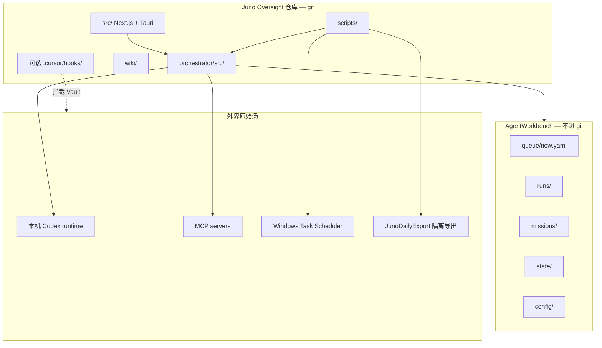
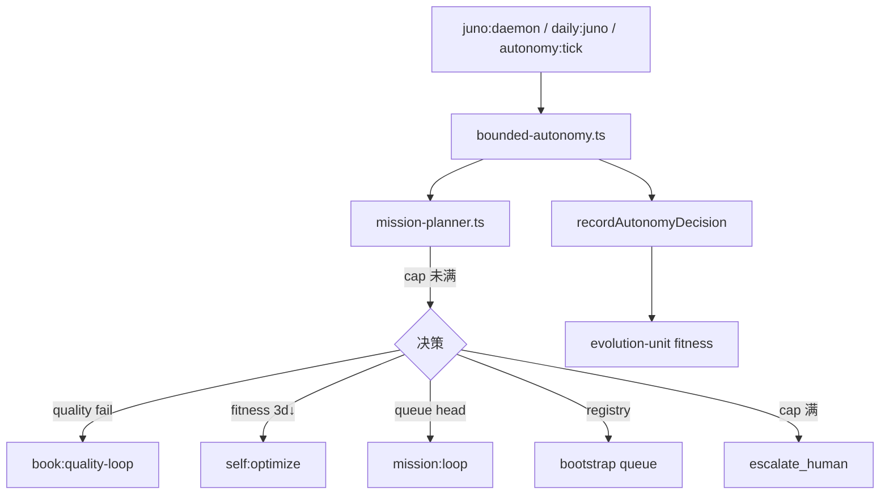
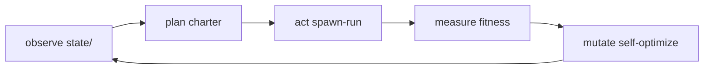
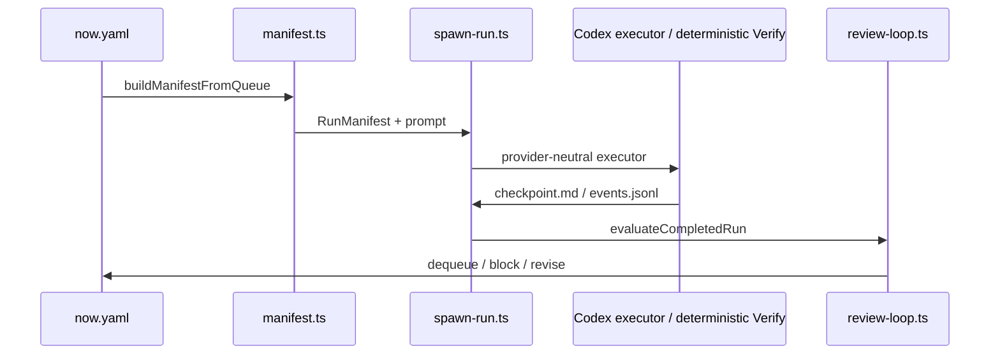

# Juno 系统架构 — 详细参考

**最后更新**：2026-07-11
**代码真源**：`orchestrator/src/` · `scripts/` · `src/`（HUD）  
**状态**：Hardening mission **COMPLETE**（h01–h11）· Von Neumann v0–v1 **已落地**

---

## 1. 三层运行时


```mermaid
flowchart TB
  subgraph repo [Juno Oversight 仓库 — git]
    HUD[src/ Next.js + Tauri]
    ORCH[orchestrator/src/]
    SCR[scripts/]
    WIKI[wiki/]
    HOOKS[可选 .cursor/hooks/]
  end
  subgraph wb [AgentWorkbench — 不进 git]
    Q[queue/now.yaml]
    RUNS[runs/]
    MISS[missions/]
    ST[state/]
    CFG[config/]
  end
  subgraph external [外界原始汤]
    API[本机 Codex runtime]
    MCP[MCP servers]
    TS[Windows Task Scheduler]
    EXP[JunoDailyExport 隔离导出]
  end
  HUD --> ORCH
  SCR --> ORCH
  ORCH --> wb
  ORCH --> API
  ORCH --> MCP
  SCR --> TS
  SCR --> EXP
  HOOKS -.->|拦截 Vault| external
```

| 层 | 路径 | 职责 | 持久化 |
|----|------|------|--------|
| **HUD** | `src/` · `src-tauri/` | 战术看板、Promote 预览、Run 控制 | 无（读 Workbench 快照） |
| **Orchestrator** | `orchestrator/src/` | 队列、spawn、门禁、planner、fitness | 编译为 `orchestrator/dist/` |
| **Workbench** | `AGENT_WORKBENCH_ROOT` | 运行时 queue / runs / missions / state | 本地磁盘，daily export 备份 |
| **Safety** | Codex sandbox · baseline v3 · deterministic verify · Promote containment | 写入边界、漂移检测、人工确认 | 仓库 + Workbench state |

运行配置与状态：

| 配置/状态 | 说明 |
|-----------|------|
| `JUNO_OVERSIGHT_ROOT` | 本仓库绝对路径 |
| `AGENT_WORKBENCH_ROOT` | Workbench 根（如 `E:\AgentWorkbench`） |
| 本机 Codex 登录态 | Live slot 鉴权；Juno 不向 Agent 注入 provider key |

---

## 2. 控制平面：Bounded Autonomy + Mission Planner

人只设 **章程**（`config/autonomy-charter.json`），不逐条 assign mission。


```mermaid
flowchart TD
  D[juno:daemon / daily:juno / autonomy:tick] --> BA[bounded-autonomy.ts]
  BA --> MP[mission-planner.ts]
  MP -->|cap 未满| DEC{决策}
  DEC -->|quality fail| BQ[book:quality-loop]
  DEC -->|fitness 3d↓| SO[self:optimize]
  DEC -->|queue head| ML[mission:loop]
  DEC -->|registry| BOOT[bootstrap queue]
  DEC -->|cap 满| ESC[escalate_human]
  BA --> REC[recordAutonomyDecision]
  REC --> EU[evolution-unit fitness]
```

### 硬限制（`DEFAULT_AUTONOMY_LIMITS`）

| 参数 | 默认 | 说明 |
|------|------|------|
| `maxSelfIterationsPerDay` | 12 | 成功 tick 计数（Asia/Shanghai 日切） |
| `maxAutoQueueMissions` | 2 | 自动 bootstrap 新 mission / 日 |
| `requireLoopGateForScheduler` | true | 24/7 前须 smoke/meta 或 stamp |
| `allowedMissionIds` | 见代码 | charter 白名单 |

### Planner 优先级（摘要）

1. 日 cap → `escalate_human`
2. fitness 下降 + API backoff → `escalate_human`
3. fitness 连续 3 日下降 → `self:optimize`
4. 书稿 quality scan 失败 → `book:quality-loop`
5. 需要 self-optimize tick → `self:optimize`
6. **`now.yaml` 队列头** → `mission:loop` 或专用 loop
7. Registry（charter 排序）→ 继续 / bootstrap
8. auto-discover（progress 有 queued、队列为空）

详见 [runtime.md](./runtime.md)（Bounded Autonomy）。

---

## 3. Von Neumann 自指单元（v0–v1）

**Mission 元数据**：`juno-von-neumann-unit-2026`（永不完结 · 度量进化）


```mermaid
flowchart LR
  O[observe state/] --> P[plan charter]
  P --> A[act spawn-run]
  A --> M[measure fitness]
  M --> U[mutate self-optimize]
  U --> O
```

| 概念 | 实现 |
|------|------|
| **控制器** | `mission-planner` + `bounded-autonomy` + `juno:daemon` |
| **度量器** | `evolution-unit.ts` → `evolution-fitness.json` + `evolution-log.jsonl` |
| **v1 反馈** | 连续 3 日 fitness↓ → planner 触发 `self:optimize` |
| **突变白名单** | `isMutationPathAllowed` — rubric / registry / mcp-hints 等 |
| **宪法** | `autonomy-charter.json`、Vault hooks — **不可自改** |

Fitness 公式（默认权重）：

```
score = 50 - 10×failedChapters - 20×apiBackoff - 3×idle
        + 25×runSuccessRate + 20×verifyPassRate
        - 30×runFailureRate - 10×reviseRate - 25×safetyBlock
```

详见 [evolution.md](./evolution.md)（Von Neumann 自指单元）。

---

## 4. 执行平面：Slot 流水线

每个 queue item 经 **materialize → spawn → evaluate → dequeue**：


```mermaid
sequenceDiagram
  participant Q as now.yaml
  participant M as manifest.ts
  participant S as spawn-run.ts
  participant A as Codex executor / deterministic Verify
  participant R as review-loop.ts
  Q->>M: buildManifestFromQueue
  M->>S: RunManifest + prompt
  S->>A: provider-neutral executor
  A->>S: checkpoint.md / events.jsonl
  S->>R: evaluateCompletedRun
  R->>Q: dequeue / block / revise
```

| RunKind | 出队条件 | 失败行为 |
|---------|----------|----------|
| **implement** | 独立 `STATUS: COMPLETE` + 非空 `## CHANGES` | 缺证据则 hold |
| **review** | `PASS` + drift 非 major + scope violations 为空 | BLOCK 不出队；REVISE → fix slot |
| **verify** | 确定性命令全部通过 + `verdict: PASS` + safety baseline 通过 | 任一非零退出或越界均 BLOCK |
| **debate** | PASS（P2 workflow） | 同 review |

**关键修复（2026-07）**：

- gate 只读取当前 `runs/<id>/checkpoint.md`，不回退 mission checkpoint，也不合成完成标记
- Mission 依赖只读取父进程签发的 `state/mission-completions/<sha256(mission-id)>.json`；mission checkpoint 只是展示
- verify 由 `verify-runner.ts` 执行真实命令并写 `verify-artifact.json`，不调用模型
- safety diff 在任何 host 命令前执行；Workbench 内 Agent 生成的 package scripts 在没有 OS 级沙箱时直接 BLOCK，不在宿主机执行
- safety baseline v3 冻结 scope-lock 与 Git root 集合，并追踪 staged/unstaged/committed diff 和 Workbench 文件树
- `openai_codex` 使用 Codex SDK；implement 可写，review/debate/vote 只读，审批固定为 never
- hardening 队列 repair — `hardening-queue.ts` 按 `progress.md` 补缺口（如 h09 丢失）

---

## 5. Orchestrator 模块地图

| 模块 | 文件 | 职责 |
|------|------|------|
| **Planner** | `mission-planner.ts` | charter + registry → 下一 action |
| **Autonomy** | `bounded-autonomy.ts` | 日限额、record tick、evolution 挂钩 |
| **Evolution** | `evolution-unit.ts` | fitness、log、planner 反馈、mutation policy |
| **Hardening Q** | `hardening-queue.ts` | progress ↔ now.yaml 同步 |
| **Spawn** | `spawn-run.ts` | provider dispatch、run-state、heartbeat |
| **Executor** | `executor.ts` | provider-neutral executor registry |
| **Codex** | `codex-executor.ts` | Codex SDK sandbox、事件与 artifact |
| **Verify** | `verify-runner.ts` | 确定性 eval profile 命令执行 |
| **Models** | `model-defaults.ts` | 默认 `openai_codex` + legacy provider canonicalization |
| **Manifest** | `manifest.ts` | QueueItem → prompt + RunManifest |
| **Review** | `review-loop.ts` | REVIEW_VERDICT / VERIFY_REPORT 解析 |
| **Progress** | `mission-progress.ts` | phase done、revise item、fail-closed gate |
| **Completion** | `mission-completion.ts` | strict immutable receipt、terminal checkpoint hash、ordinary verify 签发 |
| **Quality** | `quality-gate.ts` | 书稿 scan、spaced-bold |
| **Self-opt** | `self-optimize.ts` | scan → rubric → workflow → MCP hints |
| **API** | `api-gateway.ts` | RPM / 并发 / backoff |
| **Queue** | `queue-io.ts` | YAML CRLF 安全读写 |
| **Daily** | `daily-export.ts` · `daily-schedule.ts` | 隔离导出 + 计划任务配置 |
| **Purge** | `workbench-purge.ts` | runs/staging 安全清理 |
| **Lock** | `autonomy-lock.ts` | daemon ↔ daily-juno 互斥 |
| **Gate** | `loop-gate.ts` | smoke/meta 24h stamp |
| **Events** | `events-schema.ts` | events.jsonl 契约 |
| **Safety** | `safety-doctrine.ts` · `safety-verify.ts` | v3 frozen scope + Git/Workbench diff；fail-closed |

---

## 6. Workbench 状态文件

| 路径 | 写入者 | 用途 |
|------|--------|------|
| `state/bounded-autonomy.json` | autonomy tick | 日限额、lastAction |
| `state/mission-planner.json` | planner | 最近决策快照 |
| `state/evolution-fitness.json` | evolution-unit | 当前 fitness |
| `state/evolution-log.jsonl` | evolution-unit | 历史 score |
| `state/evolution-feedback.json` | evolution-unit | 7d MA、trend |
| `state/api-quota.json` | api-gateway | backoff、用量 |
| `state/safety-baselines/<mission-hash>.json` | safety-verify | 冻结的 v3 scope/Git/Workbench 基线；mission 内文件不能替代 |
| `state/mission-completions/<mission-hash>.json` | mission-completion | Mission 完成唯一权威 receipt；runs 被 purge 后仍有效 |
| `state/juno-daemon.json` | juno:daemon | heartbeat、cap 长睡 |
| `state/autonomy.lock.json` | autonomy-lock | daemon 互斥 |
| `state/quality-scan.json` | self-optimize | 书稿 scan |
| `state/orchestrator.json` | spawn-run | activeRunId |

Mission 级：`missions/<id>/progress.md` · `checkpoint.md`（仅展示）· `scope-lock.md` · `north-star.md`

---

## 7. 脚本入口（按场景）

| 场景 | 命令 | 脚本 |
|------|------|------|
| 24/7 自主 | `pnpm juno:daemon` | `run-juno-daemon.mjs` |
| 每日批处理 | `pnpm daily:juno` | `run-daily-juno.mjs` |
| 单轮决策 | `pnpm autonomy:tick --execute` | `juno-autonomy-tick.mjs` |
| Generic Live slot | `pnpm mission:loop` | `run-mission-loop.mjs` |
| Fitness 度量 | `pnpm evolution:tick` | `run-evolution-tick.mjs` |
| Von Neumann bootstrap | `pnpm queue:von-neumann` | `bootstrap-von-neumann.mjs` |
| Hardening 队列修复 | `pnpm queue:hardening` | `queue-hardening.mjs` |
| 自优化 | `pnpm self:optimize` | `run-self-optimize.mjs` |
| 桌面验证 | `pnpm verify:desktop` | `verify-desktop.mjs` |

---

## 8. Mission 生命周期

```text
bootstrap (scripts) → progress.md + queue/now.yaml
  → implement slot → review slot → verify slot（可选）
  → checkpoint STATUS: COMPLETE + progress done
  → wiki promote（人） / daily export（自动）
```

**Hardening**（`juno-overseer-hardening-2026`）：h01–h11 已 COMPLETE — 覆盖 quality doc、幂等 spawn、loop-gate、promote preview、verify:desktop、drift audit、final review。

**Charter 交叉 Mission**：`juno-von-neumann-unit-2026` 为 autonomy priority 0 元 mission，不算 hardening Plan 外漂移（见 Workbench `scope-lock.md` §Charter 修正案）。

---

## 9. 安全边界（不可妥协）

| 规则 | 机制 |
|------|------|
| Codex 写入边界 | SDK sandbox；仅 working directory + 明确 additional directories |
| Vault Promote | canonical containment + rule glob + server-side human confirmation |
| 可选人工 Cursor 防护 | `.cursor/hooks/*` defense-in-depth；**不是 Codex slot 的主边界** |
| 禁止 destructive shell/git | `destructive-ops-gate` + `safety-doctrine` |
| orchestrator 禁止 `file:..` 父依赖 | `check-orchestrator-deps.mjs` |
| Promote 进 Vault | 默认 `require_human: true` |
| Workbench purge | 仅 `runs/`、`staging/` + `--i-understand` |
| Live API | `api-gateway` + `config/api-limits.json` |

---

## 10. 关联文档

| 文档 | 内容 |
|------|------|
| [README.md](./README.md) | **Wiki 索引**（Runtime · Governance · Evolution · Product · Experiments） |
| [juno-architecture.md](./juno-architecture.md) | 本文 — 代码级真源 |
| [overseer-quality.md](./overseer-quality.md) | REVIEW_VERDICT 权威 |
| [juno-agi-north-star.md](./juno-agi-north-star.md) | AGI 1000 篇交付 |
| [config/README.md](../config/README.md) | Workbench 配置 |

---

## 11. 当前运行态（2026-07-11）

| 项 | 值 |
|----|-----|
| **Hardening** | COMPLETE（h01–h11） |
| **Workbench cleanup** | COMPLETE · `queue/now.yaml` 空 |
| **Tests** | 以 `corepack pnpm test` 的最新全量结果为准 |
| **Daemon** | stopped；PID/lock 已清理；terminal BLOCK 不自动重跑 |
| **Charter** | Runtime 叙事 · `landing-site-2026` forbidden |
| **Queue** | `now` 空；deferred inbox item 在 backlog |

**代码（2026-07-03）**：空队列 exit 4 不计 cap · auto-discover 用 `loopScript` · mission-loop skip-build。
