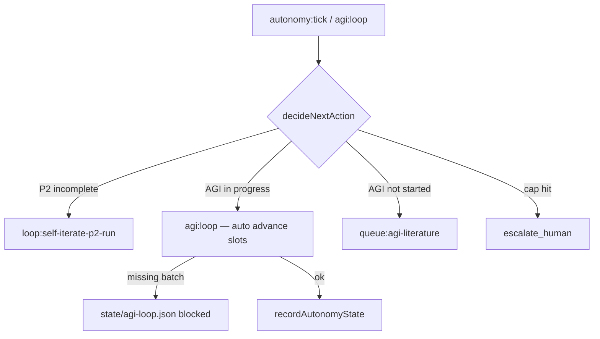

# 受限自决策（Bounded Autonomy）

**最后更新**：2026-07-01  
**代码**：`orchestrator/src/bounded-autonomy.ts`

---

## 1. 为什么需要

「初步 AGI」若 **无限制自迭代**，会重复 AutoGPT 类风险：越权改库、无限 spawn、不可审计。

Juno 采用 **文献 Amodei 式 scalable oversight** + **Constitutional** scope：

- Agent 可 **提议** 下一 Mission / 跑本地 loop  
- **不能** 绕过 loop-gate、日限额、Promote 防火墙  

---

## 2. 硬限制（DEFAULT_AUTONOMY_LIMITS）

| 参数 | 默认 | 含义 |
|------|------|------|
| `maxSelfIterationsPerDay` | 12 | 自主 loop/排队次数（含 `agi:loop`） |
| `maxAutoQueueMissions` | 1 | 自动 bootstrap 新 Mission |
| `requireLoopGateForScheduler` | true | 24/7 前须 smoke/meta 或 stamp |
| `requireHumanPromoteFor` | scheduler_enable, vault_write, git_destroy | 永远自动禁止 |
| `allowedMissionIds` | self-iterate*, agi-literature | 白名单 |

状态文件：`AgentWorkbench/state/bounded-autonomy.json`

---

## 3. 决策流



优先级：

1. P2 未完成 → P2 loop  
2. **AGI 进行中** → **`pnpm agi:loop`**（无需人工「继续」）  
3. AGI 未开始 → queue:agi-literature  
4. 超日限额 → escalate_human  

---

## 4. 命令

```bash
pnpm autonomy:tick
pnpm autonomy:tick --execute   # 决策 + 执行（含 agi:loop）
pnpm agi:loop                  # 自推进文献队列（默认最多 20 slot/次）
pnpm agi:loop --max-slots=30
pnpm agi:loop:tick             # 同 autonomy:tick --execute
pnpm agi:daemon                # **后台 daemon**：循环 agi:loop，无需 Cursor 窗口
pnpm agi:daemon:stop           # 停止后台 daemon
```

**无人值守**：`pnpm agi:daemon` 在后台每 30s 推进一轮（缺 batch 时 sleep 5min 重试）。进度见 `AgentWorkbench/state/agi-daemon.json`。

缺 batch 时写入 `state/agi-loop.json`（`blocked_missing_batch`）；补 YAML 或开 Live implement 后再跑 `agi:loop`。

---

## 5. 与 debate / OPRO 的关系

| 机制 | 自决策中的作用 |
|------|----------------|
| **debate slot** (P2) | Implement 后多视角 critique，再 review — 降低盲目自改 |
| **workflow-search** | OPRO-lite 选 workflow 变体，非无限改 prompt |
| **SAFETY_VERIFY** | verify 只读扫描，BLOCK 不扩散 |

---

## 6. 人工必介入场景

- 启用 Scheduler 24/7  
- 修改 Vault  
- 任何 destructive git  
- 日迭代 / 自动排队超限  
- AGI north-star 大改方向变更  

---

## 7. 关联

- [juno-agi-north-star.md](./juno-agi-north-star.md)
- [overseer-quality.md](./overseer-quality.md) §11
- [architecture-loop.md](./architecture-loop.md) §10–§11
