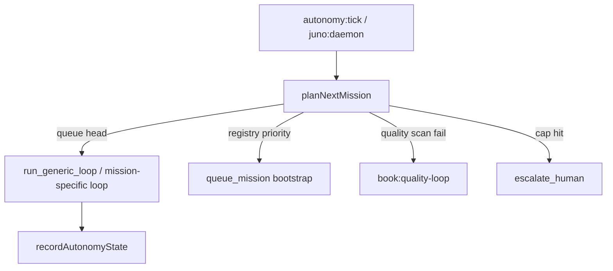

# 受限自决策（Bounded Autonomy）

**最后更新**：2026-07-03  
**代码**：`orchestrator/src/bounded-autonomy.ts`、`orchestrator/src/mission-planner.ts`

---

## 1. 为什么需要

「初步 AGI」若 **无限制自迭代**，会重复 AutoGPT 类风险：越权改库、无限 spawn、不可审计。

Juno 采用 **文献 Amodei 式 scalable oversight** + **Constitutional** scope：

- Agent 可 **提议** 下一 Mission / 跑本地 loop  
- **不能** 绕过 loop-gate、日限额、Promote 防火墙  

---

## 2. 硬限制（DEFAULT_AUTONOMY_LIMITS）

| 参数 | 默认 | 含义 |
|------|------|------|
| `maxSelfIterationsPerDay` | 12 | 自主 loop/排队次数（含 `agi:loop`） |
| `maxAutoQueueMissions` | 1 | 自动 bootstrap 新 Mission |
| `requireLoopGateForScheduler` | true | 24/7 前须 smoke/meta 或 stamp |
| `requireHumanPromoteFor` | scheduler_enable, vault_write, git_destroy | 永远自动禁止 |
| `allowedMissionIds` | self-iterate*, agi-literature, axiom-book, hardening | 白名单 |

状态文件：

- `AgentWorkbench/state/bounded-autonomy.json` — 日限额计数
- `AgentWorkbench/state/mission-planner.json` — 最近一次 planner 决策快照
- `AgentWorkbench/config/autonomy-charter.json` — **章程**（可选，见 §8）

---

## 3. 决策流



优先级（**mission-planner**，无需人工 assign）：

1. 书稿 quality scan 失败 → `book:quality-loop`  
2. 需要 self-optimize tick → `self:optimize`  
3. **`now.yaml` 队列头** → 继续该 mission（generic 或专用 loop）  
4. **Registry 顺序**：P2 → AGI → 公理之书 → hardening …  
5. 未启动且 `autoQueue` → bootstrap（如 `queue:hardening`）  
6. **auto-discover** — progress 有 `queued` 但队列为空 → 恢复  
7. 超日限额 → escalate_human  

---

## 4. 命令

```bash
pnpm autonomy:tick
pnpm autonomy:tick --execute   # 决策 + 执行（planner 选 mission）
pnpm juno:daemon               # **推荐**：后台循环 autonomy:tick --execute
pnpm mission:loop              # generic Live slot（hardening 等）
pnpm queue:hardening           # 恢复 h07–h11 到 now.yaml
pnpm agi:loop                  # 仍可直接跑 AGI（跳过 planner 时）
pnpm agi:daemon                # 仅 AGI 专用 daemon（旧路径）
```

**无人值守（全栈）**：`pnpm juno:daemon` 每 2min 一轮 `autonomy:tick --execute`。Juno 根据 `config/autonomy-charter.json` + `mission-planner` **自己选下一 mission**，人只设章程、不逐条 assign。进度见 `AgentWorkbench/state/juno-daemon.json` 与 `mission-planner.json`。

缺 batch 时写入 `state/agi-loop.json`（`blocked_missing_batch`）；补 YAML 或开 Live implement 后再跑 `agi:loop`。

---

## 5. 与 debate / OPRO 的关系

| 机制 | 自决策中的作用 |
|------|----------------|
| **debate slot** (P2) | Implement 后多视角 critique，再 review — 降低盲目自改 |
| **workflow-search** | OPRO-lite 选 workflow 变体，非无限改 prompt |
| **SAFETY_VERIFY** | verify 只读扫描，BLOCK 不扩散 |

---

## 6. 人工必介入场景

- 启用 Scheduler 24/7  
- 修改 Vault  
- 任何 destructive git  
- 日迭代 / 自动排队超限  
- AGI north-star 大改方向变更  

---

## 7. 关联

- [juno-agi-north-star.md](./juno-agi-north-star.md)
- [overseer-quality.md](./overseer-quality.md) §11
- [architecture-loop.md](./architecture-loop.md) §10–§11

---

## 8. Mission Planner + 章程（不用逐 mission 指派）

复制 `config/autonomy-charter.example.json` → `AgentWorkbench/config/autonomy-charter.json`：

```json
{
  "enabled": true,
  "charter": "Juno 自主推进 Overseer 硬化、质量修复与 AGI 栈闭合",
  "autoDiscoverMissions": true,
  "missionPriority": [
    "juno-book-quality-2026",
    "juno-overseer-hardening-2026"
  ]
}
```

| 字段 | 作用 |
|------|------|
| `enabled` | false 时 planner 返回 `stop` |
| `charter` | 写入决策 reason（审计用） |
| `missionPriority` | 覆盖 registry 默认顺序 |
| `forbiddenMissionIds` | 禁止自动碰的 mission |
| `autoDiscoverMissions` | progress 有 queued 但队列为空时自动恢复 |

Registry 默认在 `orchestrator/src/mission-planner.ts`（`DEFAULT_MISSION_REGISTRY`）；可另写 `AgentWorkbench/config/mission-registry.json` 覆盖。

**典型启动**：

```bash
# Workbench 里放好 missions 与 .env.local
pnpm autonomy:tick              # 看 Juno 会选什么
pnpm juno:daemon                # 让它自己动
```

当前 Workbench 状态（2026-07）：公理之书 COMPLETE → planner 倾向 **book quality REVISE** 或 **hardening h07–h11**（若 `now.yaml` 被清空，`queue:hardening` 会自动 bootstrap）。
