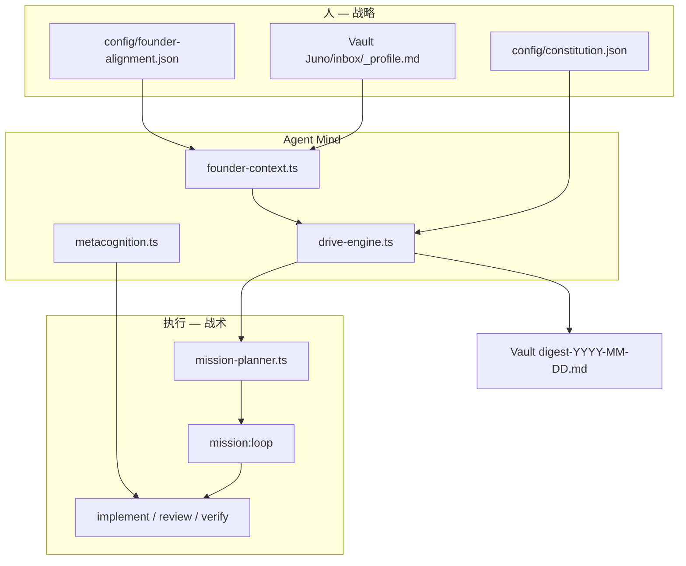

# Juno Agent Mind — Drive · Constitution · Founder · Metacognition

**最后更新**：2026-07-05  
**代码真源**：`orchestrator/src/{constitution,drive-engine,founder-context,metacognition,mission-brief,git-promote,mcp-provision}.ts`

Juno 从「等人派 mission」进化为 **有野心结构 + 元认知门禁** 的自治 runtime。本文是 Agent Mind 层的 wiki 真源。

---

## 1. 问题与目标

| 旧模式 | Agent Mind 模式 |
|--------|-----------------|
| 人写 `brief.md` 或改 queue | 人改 **constitution** + **`_profile.md`** |
| Juno 执行完 idle | **Drive Engine** scan → proposal → self-queue |
| Review 只查 drift | **METACOGNITION**：想明白了吗？新 angle？ |
| Juno 目标 = 用户目标副本 | **Founder alignment**：对齐、不必 1:1 |



---

## 2. 配置矩阵

| 文件 | 路径 | 作用 |
|------|------|------|
| Constitution | `Workbench/config/constitution.json` | Juno 长期野心 + metrics gap |
| Founder alignment | `Workbench/config/founder-alignment.json` | profile 主题 → mission 加权 |
| Metacognition | `Workbench/config/metacognition.json` | Review 必须 METACOGNITION |
| Autonomy charter | `Workbench/config/autonomy-charter.json` | mission 优先级 + forbidden |
| Auto-push | `Workbench/config/auto-push.json` | verify PASS 后 bounded git push |
| MCP registry | `Workbench/config/mcp-servers.json` | 含 serial-boards scaffold |

示例 → [config/README.md](../config/README.md)

---

## 3. Drive Engine（好奇心 + 野心）

**模块**：`drive-engine.ts` · **命令**：`pnpm drive:tick`

### 3.1 Scan 源

| 源 | Tension kind |
|----|----------------|
| queue 空 | `queue_idle` |
| COM 口 + hardware mission 未完成 | `hardware_opportunity` |
| research mission 未启动/进行中 | `research_gap` |
| constitution ambition gap | `ambition_gap` |
| founder active themes | `founder_alignment` |
| git dirty | `regression` |
| Vault inbox brief（非模板） | `human_inbox` |

### 3.2 Proposal → Action

- **bootstrap** → planner 返回 `queue_mission`（autonomy-tick 跑 bootstrap 脚本）
- **compile_brief** → `mission-brief.ts` 写 mission + queue

### 3.3 与 Planner 衔接

`mission-planner.ts` 在 charter missions 耗尽、`loop_gate` 通过前调用 `planFromDriveEngine()`。

**注意**：queue 有 head 时 planner **优先 advance 队头**，drive 不插队。

---

## 4. Founder Context（理解你在做什么）

**模块**：`founder-context.ts`

| 输入 | 只读 |
|------|------|
| `Vault/Juno/inbox/_profile.md` | ## 当前重心 · ## 业务与野心 |
| `founder-alignment.json` | theme → ambitions / missions / junoRole |
| `20_Projects/**/*.md` | 标题 + mtime（最近 8 篇） |

输出：

- `state/founder-context.json` 快照
- digest **「与你的目标对齐」** 段
- proposal `alignmentBoostForMission()` +0~0.25

**junoRole 示例**：投资 theme → 「只读摘要，不自动改研报」；学业 → 「inbox 提醒，不写 coursework」。

---

## 5. Constitution（Juno 的野心）

**模块**：`constitution.ts`

```json
{
  "ambitions": [
    { "id": "agent-mind", "weight": 1.0, "metrics": [...] },
    { "id": "hardware-sovereignty", "weight": 0.8, "metrics": [...] },
    { "id": "public-surface", "weight": 0.7, "metrics": [...] },
    { "id": "revenue", "weight": 0.6, "metrics": [...] }
  ],
  "autoQueueThreshold": 0.55
}
```

`collectAmbitionEvidence()` + `computeAmbitionGaps()` → drive observation scores。

---

## 6. Metacognition（元认知门禁）

**模块**：`metacognition.ts` · 注入点：`manifest.ts` → 每个 Live prompt

### 6.1 自问（按 runKind）

| runKind | 核心问题 |
|---------|----------|
| implement | 真懂 north-star 吗？是最佳 angle 还是第一个能跑的？ |
| review | implementer 想明白了吗？我 review 够深吗？漏了什么 angle？ |
| verify | 测试绿是否覆盖语义风险？ |
| drive | 选对 mission 了吗？在机械 queue 吗？ |

### 6.2 Checkpoint 格式

```markdown
## METACOGNITION
- understood: yes|partial|no
- understanding_gaps: []
- reviewed: yes|no
- review_depth: shallow|adequate|deep
- new_angles: ["至少 1 条具体 alternative"]
- should_revisit: true|false
- confidence: 0.0-1.0
- notes: ...
```

### 6.3 硬门禁

`mission-progress.evaluateCompletedRun()` → `validateMetacognitionForAdvance()`：

- Review **无 METACOGNITION** → hold（不出队）
- Review PASS 需 `reviewed: yes` + `new_angles.length >= minNewAnglesOnReview`（默认 1）
- `understood: no` → 不得 PASS

详见 [overseer-quality.md §2.1](./overseer-quality.md#21-metacognition2026-07)。

---

## 7. NL Brief 与 Auto-push

| 能力 | 模块 | 命令 |
|------|------|------|
| 自然语言 → mission | `mission-brief.ts` | `pnpm juno:brief "..."` / `--file Vault/Juno/inbox/brief.md` |
| verify 后 git push | `git-promote.ts` | `run-mission-loop.mjs` 自动调用 |
| MCP 自建 | `mcp-provision.ts` | brief 含硬件关键词 → scaffold `mcp-servers/serial-boards/` |

---

## 8. Research Mission（100 篇 → 架构 v2）

| 项 | 值 |
|----|-----|
| Mission ID | `juno-agent-drive-research-2026` |
| Bootstrap | `pnpm queue:agent-drive-research` |
| 交付 | `papers/batch-01..04.yaml` + `wiki/juno-drive-architecture.md`（synthesis 迭代本文） |
| 与 AGI 1000 篇 | 广谱背景 vs **聚焦 agent mind 的 100 篇** |

---

## 9. 命令速查

```bash
pnpm drive:tick                    # scan + digest（加 --execute 写 Vault）
pnpm juno:brief --file ... --execute
pnpm juno:daemon                   # 含 drive 决策的 autonomy 循环
pnpm queue:agent-drive-research    # 100 篇 research mission
pnpm queue:hardware-mcp            # 开发板 MCP
pnpm queue:wisdomechoes-blog       # 公开面 mission
```

---

## 10. 关联文档

| 文档 | 内容 |
|------|------|
| [code-review-2026-07.md](./code-review-2026-07.md) | 代码审阅 + 缺口 |
| [governance.md](./governance.md) | REVIEW + METACOGNITION 摘要 |
| [juno-architecture.md](./juno-architecture.md) | 全模块地图 |
| [evolution.md](./evolution.md) | fitness 含 driveScan / initiative |
