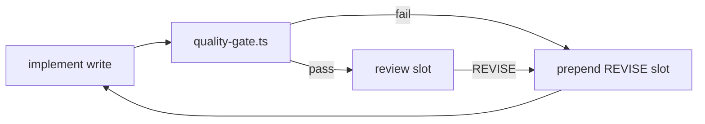

# Juno Self-Optimize — 自主优化工作流

**代码**：`orchestrator/src/self-optimize.ts` · `quality-gate.ts` · `mcp-config.ts`

---

## 1. 解决什么问题

| 问题 | 旧行为 | 新行为 |
|------|--------|--------|
| 写书 quality 注水 | review PASS 即过 | **程序化 quality-gate** + 自动 REVISE prepend |
| REVISE must_fix 丢失 | fix slot 不知修什么 | `buildReviseImplementItem(head, idx, mustFix[])` |
| workflow 不进化 | OPRO 只 log | `self:optimize` 写 `workflow-selection.json` |
| MCP 手动配 | 无 registry | `config/mcp-servers.json` → prompt + spawn 日志 |
| 书完成后 idle | await human | **bounded-autonomy** 自动 scan → quality loop |

---

## 2. 命令

```bash
pnpm self:optimize          # scan + rubric patch + workflow + MCP hints
pnpm book:quality-loop      # 跑 quality-scan 失败章的 REVISE 队列
pnpm autonomy:tick --execute  # 含 self:optimize / book:quality-loop 决策
```

---

## 3. 配置（Workbench）

复制仓库示例到 `AgentWorkbench/config/`：

| 文件 | 作用 |
|------|------|
| `self-optimize.json` | strictChapterLength、preferredBookWorkflow |
| `mcp-servers.json` | MCP 注册表；`devOnly` 仅 juno-overseer repo |

---

## 4. 写书 quality 闭环



**检测项**：spaced-bold、公理标注、本书主张、han 范围（可选 strict）

---

## 5. Bounded autonomy 优先级（书 COMPLETE 后）

1. `quality-scan` 有失败章 → `book:quality-loop`
2. 距上次 self-optimize >24h 或无 scan → `self:optimize`
3. 否则 → stop，await human north-star

---

## 6. MCP 与开发版

- `spawn-run` 对 `repoRoot: juno-overseer` 使用 **Juno 仓库 cwd**（dev 分支 + `.cursor/hooks`）
- Prompt 注入 `## MCP (workbench registry)` 块
- Obsidian Vault 仍由 `vault-gate` hook 拦截

---

## 7. 下一 mission 模板

新书 mission bootstrap 时读取：

- `state/workflow-selection.json` → `workflow_id`
- `missions/*/quality-rubric.md`（含程序化门禁段）
- `state/mcp-hints.json`
