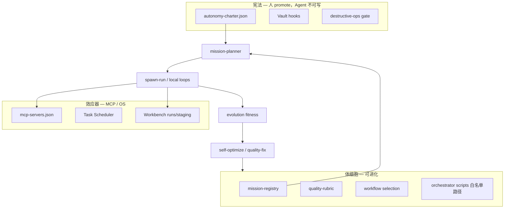

# Von Neumann 自指单元 v0

**Mission 元数据**：`juno-von-neumann-unit-2026`（永不完结 · 度量进化）  
**最后更新**：2026-07-03  
**代码**：`orchestrator/src/evolution-unit.ts` · `config/evolution-unit.example.json`

---

## 1. 定义（薛定谔 + 冯·诺依曼 → 工程）

| 概念 | 生物学/物理 | Juno 工程对应 |
|------|-------------|---------------|
| **负熵** | 开放系统排熵、维持有序 | quality-scan ↓、hardening done ↑、purge 临时 run |
| **自指** | 描述带参与自身复制 | planner 读 `state/` + 写 rubric/registry（白名单内） |
| **描述带** | 基因 | charter（**不可自改**）+ mission-registry + quality-rubric |
| **构造器** | 按带改环境 | spawn-run · implement · programmatic fix |
| **复制器** | 把带传到下一代 | git promote · daily export · evolution-log.jsonl |
| **控制器** | 何时复制/构造 | mission-planner · bounded-autonomy · loop-gate |

**最小自指单元（v0）** 一句话：

> `observe → plan → act → measure(fitness) → mutate(genotype∩whitelist)` 在 charter 内闭环，且每步可审计。

不是「无外界输入」——外界只提供 **原始汤**（API、MCP、磁盘、计划任务），不提供逐步 mission assign。

---

## 2. 三层边界（宪法 / 体细胞 / 效应器）

**与 Bounded Autonomy 的关系**：`mission-planner` + `bounded-autonomy` 是 **控制器**；`evolution-unit` 是 **度量器**。二者并行——planner 决策后 `recordAutonomyDecision` 写入 fitness；`stop` 决策扣 idle 分；`self-optimize` 单独记一条 evolution log（避免双写）。



---

## 3. 适应度（Fitness）— 单一可证伪标量

每 autonomy tick 或 `self:optimize` 写入 `state/evolution-fitness.json` + 追加 `state/evolution-log.jsonl`：

```
fitness = bookQualityTerm + hardeningTerm + capTerm + apiHealthTerm - idlePenalty
```

| 分量 | 计算 | 权重默认 |
|------|------|----------|
| bookQualityTerm | `-10 × failedChapters` | 10 |
| hardeningTerm | `+5 × hardeningPhasesDone` | 5 |
| capTerm | `+2 × (iterationsToday / maxPerDay)` | 2 |
| apiHealthTerm | backoff 中 `-20`；否则 `0` | 20 |
| idlePenalty | planner `stop` 一次 `-3` | 3 |

| **v0 边界**：fitness 度量 + **v1 planner 反馈**（`state/evolution-feedback.json`）：连续 3 日下降 → 优先 `self:optimize`；下降 + API backoff → `escalate_human`。

**v0 成功标准**（7 日滚动）：

- fitness 7 日均线不单调下降（允许单日 API 故障）
- 注入故障（删 queue、造 spaced-bold）后 **≤24h** 无人工 assign 恢复

---

## 4. 突变白名单（Genotype 可写范围）

| 允许自改 | 禁止自改 |
|----------|----------|
| `Workbench/config/mission-registry.json` 优先级 | `autonomy-charter.json` |
| `missions/*/quality-rubric.md` | Vault 任意路径 |
| `state/mcp-hints.json`（由 self-optimize 刷新） | git destructive |
| `orchestrator` 内 **promote 后** 的代码 | scheduler 总开关无 human |
| programmatic fix（quality-gate） | 超 scope-lock 的 repo 路径 |

突变必须：**implement → review → verify** 或 **本地 deterministic fix**（quality-gate）。

---

## 5. 与现有 Mission 栈的关系

| 现有 | 在 VN 单元中的角色 |
|------|-------------------|
| `juno-daily-autonomy-2026` | **控制器** — 0 点刷 cap + daemon 午夜续跑 |
| `juno-overseer-hardening-2026` | **复制器闭合** — h07 promote preview → promote 链 |
| `juno-book-quality-2026` | **免疫** — programmatic 降熵 |
| `__self_optimize__` | **突变调度** |
| `juno-agi-literature-2026` | **外显记忆** — 文献 → wiki genotype 输入 |

Planner 优先级（charter）：daily-autonomy → book-quality → **hardening** → AGI → …

---

## 6. 落地阶段

| 阶段 | 交付 | 状态 |
|------|------|------|
| **v0a** | fitness + evolution-log + wiki | 本文 |
| **v0b** | model fallback chain（auto → composer-*） | manifest + config |
| **v0c** | daily-juno 仅 cap 停；daemon 长睡 heartbeat | scripts |
| **v0e** | hardening queue 按 progress 修复（h09 缺口） | `hardening-queue.ts` |
| **v0d** | spawn-run 错误可观测 | events.jsonl |
| **v1** | fitness → planner（7d MA + decline → self-optimize） | **完成** |
| **v1b** | h09–h11 promote 链 PASS | hardening mission |
| **v2** | MCP effector 注册表扩展 + GAIA 子集 eval | 待接 |
| **v3** | orchestrator 自改 + verify 自证 | 冯·诺依曼 constructor 完整 |

---

## 7. 命令

```bash
pnpm evolution:tick          # 计算 fitness + 写 log（无 API）
pnpm self:optimize           # scan + rubric + fitness
pnpm juno:daemon             # 午夜续跑 + 日循环
pnpm daily:juno:install        # 0:00 备份批处理
pnpm queue:von-neumann         # bootstrap 元 mission 目录
```

---

## 8. 关联

- [juno-agi-north-star.md](./juno-agi-north-star.md) — L0–L8 栈
- [architecture-loop.md](./architecture-loop.md) — 自指 loop 历史
- [juno-bounded-autonomy.md](./juno-bounded-autonomy.md) — 日限额与 planner
- [juno-self-optimize.md](./juno-self-optimize.md) — 突变执行
- [api-gateway.md](./api-gateway.md) — 效应器限速
