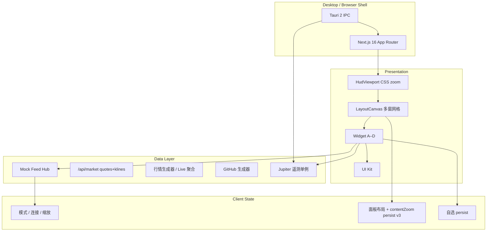

# Juno Oversight HUD — 产品白皮书

**版本**：0.1.x（Phase 1–2 + 行情 LIVE）  
**最后更新**：2026-06-02（第五轮）

---

## 1. 愿景

Juno Oversight 是一款**高信息密度、机构终端风格**的桌面战术看板（HUD）。目标用户是需要同时监视**多市场行情**、**研发/运维信号（GitHub）**、**边缘节点基础设施（Jupiter）** 与 **业务应用嵌入位** 的 builder 与小团队。

设计参照：

- **信息架构**：wtfutil 式模块化 + 可编排网格
- **视觉纪律**：Bloomberg 类深色终端、低装饰、高对比数据层
- **系统能力**：Tauri 2 原生探针（CPU/RAM、边缘遥测 IPC）

---

## 2. 设计原则

| 原则 | 说明 |
|------|------|
| 数据优先 | 数字、表格、深度、sparkline 优先于装饰性 UI |
| 单屏高密度 | 默认 1440×900 逻辑画布，FIT 缩放 75%–135%，支持手动 ± |
| 插件式 Widget | 窗口壳与业务模块解耦，经 `widget-registry` 注册 |
| 双轨运行 | 浏览器 mock 开发 + Tauri 桌面真实探针，失败自动降级 |
| 组件库统一 | 所有 HUD 样式经 `@/components/ui`，Widget 不重复造轮子 |
| 主题 | **夜间** / **土星金** / **日间** 三套 CSS 变量；顶栏图标循环切换 |
| 行情交互 | 点击行 / 搜索 → 弹出详情窗；⠿ / ↗ 同逻辑；**同标的去重置顶** |
| 行情源 | 顶栏 **LIVE / MOCK**；LIVE = Binance（Crypto）+ Yahoo（US/HK/A） |
| 行情交互 | 点击行 / 搜索 → 弹出详情窗；⠿ / ↗ 同逻辑；**同标的去重置顶** |
| 行情源 | 顶栏 **LIVE / MOCK**；LIVE = Binance（Crypto）+ Yahoo（US/HK/A） |
| 主题 | **夜间** / **土星金** / **日间** 三套 CSS 变量；顶栏图标循环切换 |

---

## 3. 系统架构

### 3.1 Widget 模块（当前）

| 代号 | 类型 | 职责 | 数据源 |
|------|------|------|--------|
| WIDGET-A | `market` | OKX 式自选列表、全市场搜索、单标的弹出窗 + K线/MACD + 盘口 | **LIVE**（Binance+Yahoo）或 Mock WS |
| WIDGET-B | `github` | 仓库事件流 | Mock WS（待接 GitHub API） |
| WIDGET-C | `infra` | SSH / 温度 / NPU / 延迟 | Tauri `get_jupiter_telemetry` 或 mock |
| WIDGET-D | `appslot` | 第三方应用 iframe 位 | 占位 |

### 3.2 全局模式

- **Omni-Surveillance**：更高刷新、更多 Ticker/深度行
- **Deep Focus**：过滤噪音（如隐藏 commit）、减少行数

### 3.3 布局与窗口交互

| 能力 | 行为 |
|------|------|
| 网格 | 12 列 × **24 行**；`compactType: null`；**允许重叠**（`allowOverlap`）；`isBounded` |
| 弹出窗 | 默认右侧 **5×14** 格；`stackOrder` 堆叠；同 `pinnedSymbol` **只保留一个** |
| 拖拽把手 | 整条 **panel-chrome**（按钮区 `cancel` 排除） |
| 画布滚动 | **无可见滚动条**；空白区 **滚轮** 纵向平移；禁止横向溢出 |
| 全局缩放 | `HudViewport` `transform: scale` + 宽高补偿；RGL **`createHudScaledStrategy(uiScale)`** |
| 拖拽持久化 | 仅在 **松手**（`onDragStop` / `onResizeStop`）写入 store，避免按下即跳 |
| 尺寸预设 | 标题栏 **1/4 \| 1/2 \| FULL**（200ms 过渡）；匹配时按钮高亮 |
| 窗内缩放 | 标题栏 **滚轮** 调 `contentZoom`（75%–150%）；**Shift+滚轮** 调格高；**Ctrl+滚轮** 调格宽 |
| 最大化 | **MAX** 或双击 `::`；仅渲染当前窗；RESTORE 还原几何 |
| 布局预设 | Default Quad / Trading Focus / Market Full；SAVE / LOAD / RESET |

用户布局持久化：`localStorage` → `juno-layout-store`（**v6**，含 `contentZoom`、`pinnedSymbol`、`stackOrder`）。行情偏好：`juno-hud-prefs`（`marketDataMode`）。

---

## 4. 技术栈

| 层 | 选型 |
|----|------|
| UI | React 19, Next.js 16, Tailwind CSS 4 |
| 状态 | Zustand（含 persist + migrate） |
| 桌面 | Tauri 2, sysinfo |
| 网格 | react-grid-layout v2 |
| 图表 | lightweight-charts 5 |

### 4.1 构建双模式

- **开发**：`pnpm dev` / `pnpm tauri:dev` — Next 使用标准 dev 服务器（`.next`），支持 HMR；`predev` 释放 3000 端口。
- **发布**：`pnpm build` — 仅此时启用 `output: "export"`，产物在 `out/`，供 Tauri `frontendDist` 加载。

开发配置与静态导出不混用，避免白屏或 `Internal Server Error`。详见 [维护手册](./maintenance.md#3-next-配置要点必读)。

---

## 5. 路线图

### 已完成（Phase 1–2）

- Bento / 多窗工作区、模式切换、Mock 行情与 GitHub
- Tauri 系统指标、Jupiter 遥测 stub
- UI Kit + `/dev/components` 目录（生产环境关闭）
- Mock 连接按 socket 实例注册、布局 v3+、窗内/格位缩放、拖拽与滚动条修复、Wiki

### Phase 3（进行中）

- **真实行情（dev）**：顶栏 LIVE/MOCK；`/api/market/quotes` + `/api/market/klines`；Crypto→Binance，US/HK/A→Yahoo
- 弹出窗去重、右侧默认尺寸、堆叠 `stackOrder`
- 交易详情：`MarketTradingChart`（K线/分时/MACD/VOL）

### Phase 3（计划）

- Tauri 静态包行情代理（`output: export` 无 Route Handler）
- 股票真 L2 盘口；深度图 Tab
- GitHub App / PAT 接入
- Jupiter SSH / NPU 真实探针
- Widget D：MBT.AI iframe + CSP 硬化
- 虚拟长列表、Toast / 命令面板、多命名 workspace

---

## 6. 非目标（当前版本）

- 非券商级下单与合规报单
- 非多用户云端同步（仅本地 persist）
- 非移动端优先布局

---

## 7. 成功指标

- 单屏 4+ 模块同时可读，无关键数字换行溢出
- 桌面端 CPU/RAM 与顶栏一致，延迟 < 2s 刷新
- 拖拽/缩放后布局重启可恢复；FIT 缩放下拖拽无错位
- 从 mock 切到真实 API 时 Widget 接口不变
