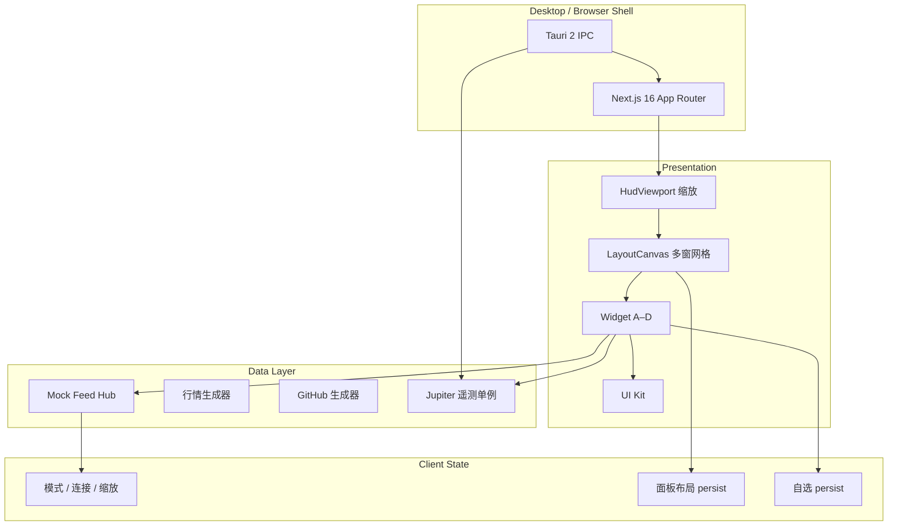

# Juno Oversight HUD — 产品白皮书

**版本**：0.1.x（Phase 1–2）  
**最后更新**：2026-06-02（第三轮）

---

## 1. 愿景

Juno Oversight 是一款**高信息密度、机构终端风格**的桌面战术看板（HUD）。目标用户是需要同时监视**多市场行情**、**研发/运维信号（GitHub）**、**边缘节点基础设施（Jupiter）** 与 **业务应用嵌入位** 的 builder 与小团队。

设计参照：

- **信息架构**：wtfutil 式模块化 + 可编排网格
- **视觉纪律**：Bloomberg 类深色终端、低装饰、高对比数据层
- **系统能力**：Tauri 2 原生探针（CPU/RAM、边缘遥测 IPC）

---

## 2. 设计原则

| 原则 | 说明 |
|------|------|
| 数据优先 | 数字、表格、深度、sparkline 优先于装饰性 UI |
| 单屏高密度 | 默认 1440×900 逻辑画布，支持 FIT 缩放与手动缩放 |
| 插件式 Widget | 窗口壳与业务模块解耦，经 `widget-registry` 注册 |
| 双轨运行 | 浏览器 mock 开发 + Tauri 桌面真实探针，失败自动降级 |
| 组件库统一 | 所有 HUD 样式经 `@/components/ui`，Widget 不重复造轮子 |

---

## 3. 系统架构

### 3.1 Widget 模块（当前）

| 代号 | 类型 | 职责 | 数据源 |
|------|------|------|--------|
| WIDGET-A | `market` | 多市场自选、Ticker、盘口 | Mock WS（待接真实行情） |
| WIDGET-B | `github` | 仓库事件流 | Mock WS（待接 GitHub API） |
| WIDGET-C | `infra` | SSH / 温度 / NPU / 延迟 | Tauri `get_jupiter_telemetry` 或 mock |
| WIDGET-D | `appslot` | 第三方应用 iframe 位 | 占位 |

### 3.2 全局模式

- **Omni-Surveillance**：更高刷新、更多 Ticker/深度行
- **Deep Focus**：过滤噪音（如隐藏 commit）、减少行数

### 3.3 布局系统

- 12 列 × 12 行逻辑网格（`react-grid-layout`）
- 面板：拖拽把手、1/4 | 1/2 | FULL、MAX/RESTORE（双击 `::` 把手）
- 最大化时**仅渲染当前窗**，避免遮挡 confusion
- 布局预设：Default Quad / Trading Focus / Market Full
- 用户布局持久化：`localStorage` → `juno-layout-store`

---

## 4. 技术栈

| 层 | 选型 |
|----|------|
| UI | React 19, Next.js 16, Tailwind CSS 4 |
| 状态 | Zustand（含 persist） |
| 桌面 | Tauri 2, sysinfo |
| 网格 | react-grid-layout (legacy API) |

### 4.1 构建双模式

- **开发**：`pnpm dev` / `pnpm tauri:dev` — Next 使用标准 dev 服务器（`.next`），支持 HMR。
- **发布**：`pnpm build` — 仅此时启用 `output: "export"`，产物在 `out/`，供 Tauri `frontendDist` 加载。

开发配置与静态导出不混用，避免白屏或 `Internal Server Error`。详见 [维护手册](./maintenance.md#3-next-配置要点必读)。

---

## 5. 路线图

### 已完成（Phase 1–2）

- Bento / 多窗工作区、模式切换、Mock 行情与 GitHub
- Tauri 系统指标、Jupiter 遥测 stub
- UI Kit + `/dev/components` 目录（生产环境关闭）
- Mock 连接 ref-count、布局提交优化、Wiki

### Phase 3（计划）

- 真实行情分源（CRYPTO / US / HK / A股）
- GitHub App / PAT 接入
- Jupiter SSH / NPU 真实探针
- Widget D：MBT.AI iframe + CSP 硬化
- 虚拟长列表、Toast / 命令面板、多命名 workspace

---

## 6. 非目标（当前版本）

- 非券商级下单与合规报单
- 非多用户云端同步（仅本地 persist）
- 非移动端优先布局

---

## 7. 成功指标

- 单屏 4+ 模块同时可读，无关键数字换行溢出
- 桌面端 CPU/RAM 与顶栏一致，延迟 < 2s 刷新
- 拖拽/缩放后布局重启可恢复
- 从 mock 切到真实 API 时 Widget 接口不变
