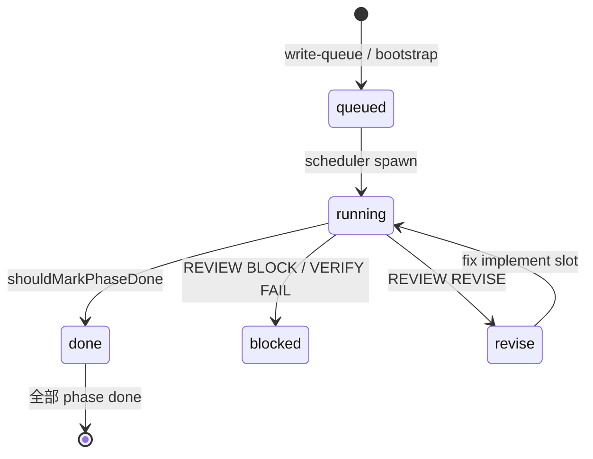

# Agent Workbench — 运行时目录

**默认路径**：`E:\AgentWorkbench`  
**环境变量**：`AGENT_WORKBENCH_ROOT`  
**初始化**：`.\scripts\scaffold-workbench.ps1`

Workbench 是 Orchestrator 的**唯一运行时状态根**。Juno 仓库只含 orchestrator 源码与 HUD；Mission、queue、runs 均在此目录。

---

## 1. 目录树

```
E:\AgentWorkbench\
├── config.yaml              # vault_path、quiet_hours、promote 规则
├── queue/
│   └── now.yaml             # 活跃队列 now: + backlog:
├── missions/
│   └── <missionId>/
│       ├── north-star.md    # 完成定义
│       ├── scope-lock.md    # 允许/禁止路径
│       ├── progress.md      # phase 表格（queued/done）
│       └── checkpoint.md    # Mission 级汇总（可选）
├── runs/
│   └── <runId>/             # 见 orchestrator.md §3
├── prompts/
│   ├── executor_implement.md
│   ├── executor_review.md
│   ├── executor_verify.md
│   ├── executor_research.md
│   ├── executor_jinstone.md
│   ├── morning_plan.md
│   ├── evening_rollup.md
│   ├── mission_plan.md
│   └── generic.md
├── state/
│   ├── orchestrator.json    # activeRunId、activeRunStatus、lastRunId
│   ├── scheduler.json       # enabled、runsToday、lastAction、lastTickAt
│   └── daemon.pid
├── daily/
│   └── YYYY-MM-DD.md        # Daily Digest 源
├── staging/                 # Promote 暂存（→ Vault）
└── .cursor/hooks/           # 镜像自 Juno（sync-workbench-hooks.mjs）
```

---

## 2. config.yaml

```yaml
vault_path: "E:\\Obsidian Vault"
quiet_hours:
  start: "23:00"
  end: "07:00"
promote:
  require_human: true
scheduler:
  require_loop_gate: false   # true 或 JUNO_REQUIRE_LOOP_GATE=1 → spawn 前 loop 门禁
```

- **vault_path**：Promote 目标；`vault-gate.mjs` 拦截 Agent 读写  
- **quiet_hours**：Scheduler 不 spawn 新 slot  
- **scheduler.require_loop_gate**：见 [architecture-loop.md §4](./architecture-loop.md#4-loop-gatescheduler-前置)
- **promote.require_human**：Promote 面板需确认  

---

## 3. Mission 生命周期



### 3.1 三份契约文件

| 文件 | 谁写 | 作用 |
|------|------|------|
| `north-star.md` | 人类 / bootstrap | 「什么叫完成」 |
| `scope-lock.md` | 人类 / bootstrap | 允许改哪些路径 |
| `progress.md` | Scheduler（自动）+ 人类 | phase 状态表 |

### 3.2 当前 Mission 示例

| mission_id | 用途 |
|------------|------|
| `juno-smoke-loop-2026` | 最小 implement→review→verify 试跑 |
| `juno-overseer-hardening-2026` | Orchestrator 硬化 backlog |
| `juno-agent-literature-2026` | Agent 文献调研 |
| `landing-site-2026` | 落地页（若存在） |

---

## 4. Prompt 模板

| 模板 | run_kind | 说明 |
|------|----------|------|
| `executor_implement` | implement | 改代码；写 CHANGES |
| `executor_review` | review | 只读；写 REVIEW_VERDICT |
| `executor_verify` | verify | 只跑测试；写 VERIFY_REPORT |
| `executor_research` | implement | 文献/调研 slot |
| `executor_jinstone` | — | Jinstone 专项 |
| `morning_plan` / `evening_rollup` | day | Daily 计划/汇总 |
| `mission_plan` | — | Mission 规划 |
| `generic` | — | 兜底 |

模板正文在 `prompts/<name>.md`；`buildUserPrompt` 还会注入 mission 摘录、quality §、safety §11、checkpoint、events tail。

---

## 5. Queue 操作

```powershell
# 写入 smoke loop（默认不启用 scheduler）
.\scripts\bootstrap-smoke-loop.ps1

# 自定义队列
node scripts/write-queue.mjs

# 恢复备份
Copy-Item queue\now.yaml.bak-* queue\now.yaml
```

**注意**：bootstrap 会覆盖 `now.yaml`；重大 Mission 前先备份。

---

## 6. state/ 字段

### orchestrator.json

```json
{
  "activeRunId": null,
  "activeRunStatus": "idle",
  "lastRunId": null,
  "updatedAt": "…"
}
```

| activeRunStatus | 含义 |
|-----------------|------|
| `idle` | 无活跃 run |
| `running` | spawn-run 执行中 |
| `done` | 正常结束 → scheduler 处理出队 |
| `failed` | 非零退出 |
| `stall` | watchdog 杀死 |

### scheduler.json

```json
{
  "enabled": false,
  "runsToday": 0,
  "missionInjectIntervalMin": 90,
  "lastAction": "paused_repo_recovery",
  "lastTickAt": null,
  "daemonStartedAt": null
}
```

`enabled` 仅由人类或面板切换；daemon **启动时不再强制 true**。

---

## 7. Promote 流程

1. Agent 写入 `staging/<subdir>/`  
2. **WIDGET-P** 列出 staging 条目；选中后 **干跑** `preview_promote_to_vault`（diff 摘要 + 目标 Vault 路径）  
3. 人类确认 → Tauri `promote_to_vault`；`state/promote.log` 记录 PREVIEW/PROMOTE  
4. 复制到 Obsidian Vault（hook 仍禁止 Agent 直接写 Vault）

---

## 8. 安全边界

| 区域 | Agent 权限 |
|------|-----------|
| Juno Oversight 仓库 | implement slot + scope-lock |
| AgentWorkbench | missions/runs/staging |
| Obsidian Vault | **禁止**（vault-gate） |
| 递归删除 / git reset --hard | **禁止**（destructive-ops-gate） |

同步 hooks：`node scripts/sync-workbench-hooks.mjs`

---

## 9. 排错

| 现象 | 处理 |
|------|------|
| Scheduler 不 spawn | 查 `enabled`、quiet hours、orchestrator 是否 stuck `running` |
| 同一 slot 不重启 | `last_run_dedup` → 清 `lastRunId` |
| progress 不更新 | 查 checkpoint 是否满足 `shouldMarkPhaseDone`（见 overseer-quality §8） |
| Mission 文件乱码 | bootstrap 脚本用 UTF-8 no BOM |

详见 [overseer-quality.md](./overseer-quality.md) 与 [orchestrator.md](./orchestrator.md)。
